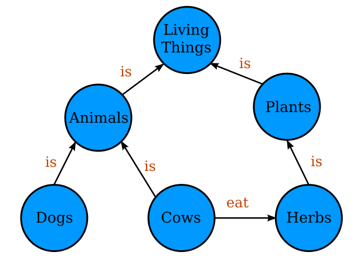
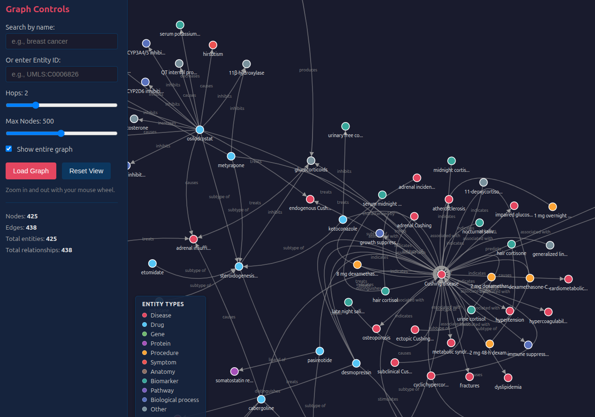
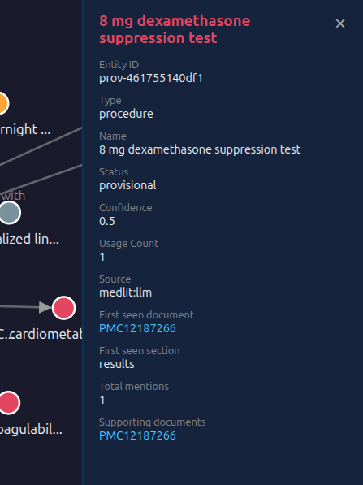

---
title: Knowledge Graphs from Unstructured Text
author: Will Ware
rights: © 2026 Will Ware, MIT License
language: en-US
description: "A practitioner's guide to building knowledge graphs from unstructured text using LLMs."
...

## Preface

This is a book written in the age of Large Language Models, but the central thesis of this book is about machine reasoning in general, now and in the future. Knowledge graphs predate LLMs and will outlast them, because they capture something essential to how humans understand and reason about complex fields in an explicit, structured form that can be shared and curated. A machine cannot reason reliably about such fields without knowledge encoded in some form of graph. The software projects described here are demonstrations of this thesis, not the subject of it. LLMs are enablers for the creation of knowledge graphs, which were much discussed in the past but only practical at scale now.

This is a picture of a simple knowledge graph. Bubbles and arrows (we can call them "nodes" and "edges" or "vertices" and "edges") both have labels representing metadata. Graph theory is a branch of mathematics that includes non-trivial theorems and results.

The gist of this book (beyond providing a lot of how-to information) is that a knowledge graph in some form is

- a necessity, not just a convenience, for reliable machine reasoning
- an explicit representation of how human experts understand difficult topics

# Part I: The Landscape

## Chapter 1: Why do we want to build Knowledge Graphs?

`\chaptermark{Why build Knowledge Graphs?}`{=latex}

### Large Language Models Work Great

We ask them questions about the capitals of countries, or about a chemical formula, or how long to bake something in the oven, and usually we get an answer that is articulate, confident, intelligent-sounding, and correct. We can go to Wikipedia or Google and confirm that, yes, that is the right answer. It's a feel-good moment. The fluency is real. The models have internalized an enormous amount of surface pattern from human text, and for a large class of questions that pattern is enough.

### Until They Don't

Correctness was never a primary design priority for LLMs. They are neural networks trained on large corpora. They try to predict the next bit of text, following statistical patterns derived from the training set. As long as our questions stay well within the training set, we can expect answers that are correct most of the time.

When we stray outside the training set contents, the LLM has no mechanism or structure to gauge correctness and no way to correct an answer. We get answers that are articulate, confident, intelligent-sounding, and wrong. My brother told an LLM:

> I live near a carwash and the weather is warm and sunny. I want to get my car washed. Should I walk or drive there?

and of course he was told that on a nice day like this, he could use the exercise, so he should walk to the carwash.

The LLM only "knows" what's in the training set, only the statistical patterns of the text it was trained on. It doesn't know that he'll need his car in order to get it washed. The dangerous part is that the wrong answer was delivered with the same tone and confidence as a right one would have been. There is no internal signal that says "I'm extrapolating here" or "I'm not sure." The machine has no way to distinguish a retrieval from memory from a plausible guess. This is **hallucination** -- the model producing confident, fluent, false output because it is doing what it was designed to do (generate statistically plausible text) in a situation where the right answer is not well represented in its training. Hallucination is not a bug to be patched; it is a predictable consequence of how LLMs work.

### The Scale of the Problem

For casual use, hallucination might be acceptable. For anything that matters -- medical advice, legal research, scientific synthesis, technical decisions -- we need more than fluency. We need answers that are grounded in something checkable, that can be traced to a source, that can be updated when the world changes, and that reflect the structure of the domain rather than the statistics of the training corpus. That is a different kind of system.

### Retrieval-Augmented Generation or "RAG"

We can artificially extend the scope of the training set by adding content to the prompt for the parts the LLM is likely to get wrong. My brother might have created a prompt describing car wash operations and mentioning that the car must be physically present for the operations to work. With the prompt extended in this way, eventually the LLM would stop making that kind of mistake. That would have been a laborious manual process of tinkering and re-wording, and seeing what worked best. This approach would not scale to large bodies of knowledge.

In practice, RAG usually means retrieving relevant passages from a document store and stuffing them into the prompt. That helps: the model can reason over the retrieved text instead of relying solely on training. But retrieved passages are still just text. The model has to parse them, resolve references, and combine information across snippets on the fly. There is no explicit representation of *what* entities are in play or *how* they are related. The structure of the domain stays implicit in the prose, and the model is left to infer it every time. For narrow, one-off questions that can be answered from a few paragraphs, this often works. For complex reasoning that depends on many entities and relationships, or for questions you didn't know to ask in advance, passage retrieval hits its limits.

### Graph RAG

The LLM is given a knowledge graph to consult. Instead of raw passages, it gets entities and typed relationships: this drug *treats* this condition, this gene *encodes* this protein, this study *reports* this finding. The graph answers "what is connected to what" and "what kind of connection is it" in a form the model can traverse and cite. The entities and the links between them provide facts, context, names, dates, and meaningful connections. You knew you were asking an egg question for your omelette but you didn't realize in advance that you might also want to know how to tell if an egg has gone bad; the graph can surface that connection because the structure is explicit.

A knowledge graph built from your domain gives the model something to reason *from* rather than something to paraphrase. Claims can be traced to sources. Gaps and conflicts in the graph are visible. When the underlying evidence changes, you update the graph instead of retraining the model. The graph is a shared, inspectable representation of what the system is allowed to "know" in that domain.

### Why Bother Building One?

Knowledge graphs provide a unique return on investment. They are simple data structures, easy to understand, not too difficult to build with the tools we have now, and easy for an LLM to query. They reflect the shape of human knowledge with surprising accuracy when the extraction is done well. The rest of this book is about when you want one, how to design it, and how to build it from the unstructured text where most of that knowledge still lives.

## Chapter 2: A Brief History of Knowledge Representation

`\chaptermark{Knowledge Representation History}`{=latex}

### The Idea That Wouldn't Die

There is a fantasy at the heart of computing that is almost as old as computers themselves: the machine that doesn't just store and retrieve facts but *understands* them. Not a filing cabinet you query with the right syntax. Not a search engine that hands you links and wishes you luck. A machine that knows things the way a person knows things -- that can be asked a question in plain language, draw on what it understands about the subject, and tell you something true and useful in return.

This fantasy has motivated some of the most ambitious projects in the history of computer science. It has attracted brilliant people, absorbed enormous funding, and produced genuine results -- and then, repeatedly, stalled. Not because the researchers were wrong about what they were trying to build. Because building it turned out to be much harder than it looked, for reasons that took decades to fully understand.

That history is worth understanding, because the stall always happened in the same place. Not at the reasoning end -- humans got surprisingly far at encoding the *logic* of a domain, the rules and relationships and inference patterns that experts use. The wall was always at the other end: getting knowledge *in*. Turning the vast, messy, ambiguous record of what humans know -- written in papers and books and case notes and specifications, in the imprecise and context-dependent medium of natural language -- into something a machine could actually reason over. That problem defeated every approach until very recently.

This chapter is the story of those attempts. It is not a story of failure. The people who built expert systems in the 1980s, who designed the Semantic Web in the 1990s, who curated Freebase in the 2000s -- they were right about what was needed. They were working with the tools available to them. The story is worth telling because in retrospect we can see the same general idea approached from different directions, stalling at the same bottleneck, until the idea could finally get the traction it needed.

### What the Frog's Eye Tells Us

In 1959, a paper appeared in the *Proceedings of the IRE* with an unusually vivid title: "What the Frog's Eye Tells the Frog's Brain." Its authors were Jerome Lettvin, Humberto Maturana, Warren McCulloch, and Walter Pitts, and its central finding was startling enough that it still rewards a careful reading sixty-five years later.

The experiment was straightforward in concept. Lettvin and his colleagues placed electrodes in the optic nerve of a frog and observed which retinal ganglion cells fired in response to which visual stimuli. What they found was that the frog's retina doesn't send the brain a raw image. It sends the brain *processed features* -- small dark moving objects (bugs), large dark approaching shapes (predators), sharp edges, sudden dimming. By the time the signal reaches the frog's brain, the eye has already done substantial interpretation. The retina is not a camera. It's a feature extraction pipeline.

The implications reached beyond frog vision. If perception in even a simple vertebrate is not passive reception of raw data but active, structured, selective extraction of semantically meaningful features, then the prevailing model of how biological intelligence works -- sense first, interpret later -- was badly wrong. Meaning isn't added to perception after the fact. It's built into the extraction process itself. Intelligence, biological or artificial, doesn't work by accumulating raw data and reasoning over it afterward. It works by extracting structured signals and reasoning over *those*.

What the frog's eye tells us is that the process of importing data must impose structure on that data if subsequent reasoning is to succeed.

### Semantic Networks and the Frame Problem

The graph as a mathematical object is ancient. Euler's 1736 solution to the Königsberg bridge problem -- can you cross each of the city's seven bridges exactly once? -- is usually cited as the birth of graph theory, and the centuries of results that followed established it as a mature branch of mathematics long before anyone thought to use it for knowledge representation. Euclid's *Elements*, two thousand years earlier, had definitions, propositions, and logical dependencies between them that you could draw as a directed acyclic graph -- but Euclid wasn't making a claim about knowledge representation, he was doing geometry. The data structure, in some form, has always been available. The question was whether anyone would recognize it as the right structure for something other than bridges and triangles.

The answer, in the context of AI, arrived in 1966 with Ross Quillian's doctoral dissertation on semantic memory. Quillian was trying to represent the meanings of words -- not as dictionary definitions but as structured networks of relationships. The word "plant," in Quillian's model, wasn't defined by a string of text; it was a node connected by labeled links to other nodes representing its properties, its categories, its relationships to other concepts. This was recognizably a knowledge graph in embryonic form, and it established the semantic network as a tool for AI research.

Minsky's contribution, in his 1974 paper "A Framework for Representing Knowledge," was different in kind. He wasn't just proposing a data structure -- he was making a cognitive claim. The claim was that when humans encounter a situation, they don't process it from scratch. They retrieve a pre-existing structure -- a frame -- that represents a stereotypical version of that kind of situation, with slots for the details that vary. A "restaurant" frame has slots for host, menu, food, check, tip. When you walk into a restaurant you don't reason from first principles about what's happening -- you instantiate the frame and fill in the slots from what you observe. The frame carries default values for unfilled slots, which is how you know to expect a menu before one appears.

What made Minsky's paper feel vague to readers who wanted a specification -- and it did feel vague, the reaction was common and not a failure of reading -- was that he deliberately left open how frames were organized, how the right frame gets retrieved, how conflicts between frames get resolved, how new frames get created. These are hard problems and he largely left them open. He was sketching a research agenda, not specifying a system. In retrospect this was the right choice: premature formalization of a half-understood idea produces a wrong formalism that is harder to correct than a productive sketch. Minsky was doing what good theorists do at the frontier -- pointing confidently at something real without pretending to have fully characterized it.

The frame problem -- related to but distinct from Minsky's frames -- is the AI challenge of representing what *doesn't* change when something happens. If you move a block from one table to another, the block's color doesn't change. This seems obvious; it's extraordinarily difficult to formalize in a way that scales. Every action in a world has a vast number of things it doesn't affect, and a reasoning system that has to explicitly represent all of them is overwhelmed before it begins. The frame problem was one of the first demonstrations that human common sense, which handles this effortlessly, is hiding enormous computational complexity.

What frames and semantic networks got right -- what makes them the direct ancestors of the knowledge graph -- is the claim that the relationships *are* the knowledge. Not an index of facts with relationships as an afterthought, but a structure in which meaning is constituted by connection. A node in isolation is just a label. A node embedded in a graph of typed relationships to other nodes is a concept, with implications, with context, with a place in a web of meaning. This is not just a useful engineering observation. It is, as Minsky was arguing, a description of how intelligence works -- how a mind, human or artificial, can know what it knows in a way that supports inference rather than mere retrieval.

The knowledge graph as built today is in many ways the realization of what Minsky was gesturing at: a rigorous, computable, queryable structure where entities have typed relationships, where context shapes interpretation, where the graph itself carries meaning rather than merely pointing at it. The difference is that Minsky was working at the level of cognitive theory, and we are building infrastructure. The informality that frustrated impatient readers in 1974 has become, fifty years later, a schema definition language and a pipeline.

### Meaning is Relational

Douglas Hofstadter's argument in *Gödel, Escher, Bach* is directly relevant here, and the connection is tighter than it might first appear.

Hofstadter's central concern is how meaning arises in formal systems -- how symbols, which are just patterns, come to *refer* to things in the world. His answer, developed through the interweaving of Gödel's incompleteness theorems, Escher's self-referential drawings, and Bach's fugues, is that meaning isn't a property of individual symbols but of *symbol systems* -- of the relationships and transformations between symbols. A symbol means something because of its position in a web of other symbols and the rules that connect them. Isolate the symbol from that web and the meaning evaporates.

This is precisely the claim that frames and semantic networks were making, and that knowledge graphs embody. A node in a knowledge graph isn't meaningful in isolation -- "BRCA1" as a string of characters means nothing. It means something because of its typed relationships to other nodes: it *encodes* a protein, it *is associated with* breast cancer risk, it *interacts with* other genes, it *has synonym* "breast cancer type 1 susceptibility protein." The meaning is in the web, not in the label.

Hofstadter goes further in a way that connects to Chapter 4's argument. He distinguishes between what he calls *active symbols* and passive ones. A passive symbol is just a token that gets manipulated by external rules -- the symbols in a formal logical system, for instance. An active symbol is one that participates in its own interpretation, that has something like internal structure that fires in response to the right context. His argument is that genuine intelligence requires active symbols -- that what brains do, and what any sufficiently sophisticated reasoning system must do, is maintain a network of active symbols that mutually constrain and activate each other.

The knowledge graph, in this framing, is an attempt to make active symbols computationally tractable. Not just a passive lookup table but a structure where the typed relationships do real work -- where querying "what treats this disease" is not a string match but a traversal of a semantic network that carries the meaning of "treats" as a typed predicate with defined subject and object constraints. The graph doesn't just store the claim; it participates in the reasoning.

There's a passage in GEB where Hofstadter discusses the difference between the *map* and the *territory* -- between a representation and the thing it represents -- and argues that sufficiently rich representations develop a kind of isomorphism with their subject that amounts to genuine understanding. The representation isn't just *about* the territory; it captures enough of the territory's structure that reasoning over the representation produces true results about the territory. This is, almost word for word, the argument your Chapter 4 is making about knowledge graphs and grounded inference.

Hofstadter gave us the theoretical vocabulary for why symbol systems need to be relational rather than atomic, why meaning is constituted by connection rather than inherent in labels, and why a sufficiently structured representation can support genuine inference rather than mere retrieval. Minsky gave us the cognitive architecture -- frames as the natural unit of structured knowledge. The knowledge graph is what you get when you take both of those arguments seriously and ask: what does this look like as buildable infrastructure?

### The Logic Wars

The expert systems of the 1970s and 80s were not a wrong turn. They were a genuine insight, implemented with the tools available, and in the right conditions they worked remarkably well.

The insight was this: if you could get a domain expert to articulate the rules they used to reason -- the *if-this-then-that* chains that an experienced diagnostician or engineer carried in their head -- you could encode those rules in a formal system and the machine could apply them. MYCIN, the system built at Stanford in the early 1970s to diagnose bacterial infections and recommend antibiotics, could outperform medical residents on its target task. XCON, deployed by Digital Equipment Corporation to configure VAX computer systems, was saving the company tens of millions of dollars a year by the early 1980s. These weren't demos. They were production systems doing real work.

The problem was at the edges of the recorded knowledge domain. A domain expert can articulate the rules they consciously apply, but expertise isn't just conscious rules -- it's also the vast background of common sense and contextual judgment that experts exercise without noticing they're doing it. Ask a doctor what rules she uses to diagnose a bacterial infection and she can tell you. Ask her what rules she uses to know that a patient who says "I feel fine" while running a 104-degree fever is not, in fact, fine -- and she'll struggle, because that knowledge isn't stored as rules. It's pattern recognition built from years of experience, running below the level of explicit articulation.

Expert systems couldn't capture that. They could only encode what the expert could say out loud. Everything else -- the background assumptions, the common sense, the contextual adjustments -- had to be anticipated and written down by a knowledge engineer. And it turned out that the space of things you had to anticipate was essentially unbounded. Add a new drug to MYCIN's domain and suddenly you needed new rules, and new rules to handle the interactions with old rules, and new rules to handle the exceptions to those interactions. The system that worked beautifully on the original narrow problem became brittle the moment the world asked it a question slightly outside its prepared territory.

Prolog and the description logics that followed were attempts to put the reasoning on a more rigorous mathematical footing. If the problem with expert systems was that the rules were ad hoc and hard to maintain, maybe formal logic would help -- a cleaner representation that could be reasoned over systematically, whose consequences could be derived rather than enumerated. The logic was sound. The problem was the same: you still had to get the knowledge in. Formal logic made the representation more principled, but it didn't make knowledge acquisition any less expensive or any less brittle when the domain proved more complex than the ontology anticipated.

By the early 1990s, the expert system boom had become the AI winter. Funding dried up, companies that had bet heavily on the technology quietly wrote off their investments, and the field moved on. What it left behind was a lesson that wouldn't fully land for another thirty years: the bottleneck was never the reasoning. It was always importing the knowledge at scale.

### The Semantic Web and the RDF Era

Tim Berners-Lee invented the World Wide Web and then, almost immediately, started worrying that he'd built the wrong thing.

The web he'd built was for humans. Pages of text and images, linked to other pages, navigable by people who could read and follow links and make inferences about what they were looking at. Machines could fetch the pages, but they couldn't understand them -- couldn't know that a page about a restaurant contained a phone number, or that a page about a drug contained a dosage, or that two pages from different sources were talking about the same person. The web was a vast store of human knowledge wrapped in a format that machines could retrieve but not comprehend.

His vision for fixing this, described in a 2001 *Scientific American* article, was the Semantic Web. The idea was to augment the existing web with structured, machine-readable data, encoded in a standard format called RDF (Resource Description Framework), so that software agents could traverse the web and actually *understand* what they were reading. Not just fetch a page about a drug, but know that the page described a drug, that the drug had a name and a manufacturer and a set of indications, and that those indications were linked to diseases described on other pages. The web of documents would become a web of data.

The vision was sound. The problem was asking people to do a lot of work for benefits that mostly accrued to others.

Encoding your content as structured RDF was significantly more effort than writing HTML. The tools were complex, the standards were baroque, and the payoff for any individual publisher was unclear -- the value of structured data emerges when many sources use compatible schemas, and in 2001 nobody was. The classic adoption problem: the network is worth joining only when enough other people have joined, but nobody wants to be first. Only a few large institutions -- libraries, government data publishers, some academic databases -- embraced the vision seriously.

What emerged from the wreckage was Linked Data, a more pragmatic interpretation of the same basic idea. Instead of demanding that everyone adopt a comprehensive semantic framework, Linked Data asked only that you use URIs to identify things, link to related URIs from other datasets, and publish whatever structured data you had in whatever simple format you could manage. It was a retreat from the grand vision, but it was a retreat to something that actually worked. DBpedia -- a structured version of Wikipedia extracted by the community -- became a hub that linked to dozens of other datasets. Wikidata grew into something genuinely useful. The government open data movement produced real structured datasets. A modest version of the dream was alive.

The community sold Linked Data coffee mugs to encourage adoption. It was that kind of movement, idealistic, slightly desperate, held together by enthusiasm and standards documents. The web did not restructure itself accordingly.

But the fundamental problem remained. Linked Data worked well for knowledge that someone had already structured. The vast majority of what the web contained -- the papers, the articles, the reports, the case studies, all the text -- remained opaque. You could link your structured data about a drug to Wikipedia's article about that drug, but you couldn't automatically extract the structured data from the article in the first place. The extraction bottleneck was still there, just slightly better acknowledged.

### The Industrial Knowledge Graph

In May 2012, Google announced what it called its Knowledge Graph with a phrase that became a kind of slogan for the field: the goal was to understand "things, not strings." Instead of matching keywords to documents, Google wanted its search engine to understand that "Leonardo da Vinci" was an entity -- a person, with a birthdate, a nationality, a set of works -- and that queries about him were queries about that entity, not just about a sequence of characters. The knowledge panel that appears to the right of search results when you search for a person, place, or organization is the visible surface of this system.

The Knowledge Graph didn't emerge from nowhere. Its initial corpus was built primarily from Freebase, a structured knowledge base that a company called Metaweb had been developing since 2007 and that Google acquired in 2010. Freebase was itself a descendant of the collaborative, community-edited spirit of Wikipedia, but where Wikipedia stored knowledge as prose, Freebase stored it as structured facts: typed entities connected by typed relationships, contributed and edited by users. By the time Google folded it into the Knowledge Graph, Freebase contained roughly 44 million topics and 2.4 billion facts. Google supplemented this with Wikipedia, the CIA World Factbook, and other structured sources. The graph grew rapidly -- tripling in size within seven months of launch, reaching 570 million entities and 18 billion facts by the end of 2012, and eventually growing to hundreds of billions of facts on billions of entities.

What Google demonstrated at scale was that a knowledge graph was extraordinarily useful for a specific class of questions: factual queries about well-known entities. Who directed this film? When was this person born? What is the capital of this country? For these queries -- where the answer is a fact about a named entity that exists in the structured corpus -- the knowledge panel delivers an answer directly, without the user needing to click through to a source. This was genuinely transformative for search, and it established the knowledge graph as production infrastructure rather than academic exercise.

But it also revealed, somewhat quietly, what the approach could *not* do. The Google Knowledge Graph was built almost entirely from structured sources -- curated databases, collaborative encyclopedias, government factbooks. It was very good at facts that someone had already explicitly encoded. It had almost no ability to extract knowledge from the unstructured text that makes up the vast majority of what humans have written. Google's own internal research project, Knowledge Vault, attempted to address this -- automatically harvesting facts from across the web -- but it remained a research effort rather than a production system, and the problem of reliably extracting structured knowledge from free text remained essentially unsolved.

Freebase itself was shut down in 2016, its data migrated to Wikidata, the open collaborative knowledge base that now serves as one of the primary structured sources for the Knowledge Graph. The arc is instructive: even Google, with essentially unlimited engineering resources, found it easier to rely on human-curated structured data than to solve the extraction problem at the quality level required for production use. The extraction bottleneck wasn't a failure of ambition. It was a genuine hard problem that the tools of the time couldn't crack.

### The Extraction Bottleneck

Every era of knowledge representation described in this chapter ran into the same wall, approached from a different direction. The semantic networks of the 1960s and 70s had to be hand-built by knowledge engineers -- a process so labor-intensive that the resulting systems covered narrow domains at best. The expert systems of the 80s required domain experts to spend months encoding their knowledge as rules, and still couldn't capture the tacit understanding that experts applied effortlessly. The Semantic Web vision of the 90s and 2000s imagined a world where structured data would be published everywhere -- but the incentive for any individual publisher to do the hard work of structuring their content for others' benefit was never quite strong enough. And Google's Knowledge Graph, for all its scale, was built from the structured sources that already existed: databases, encyclopedias, factbooks. It was excellent at encoding what had already been made explicit. It had no way to reach the knowledge that hadn't.

The uncomfortable arithmetic is this: the vast majority of what humanity knows is written down in natural language -- in papers, books, reports, articles, case studies, clinical notes, legal opinions, engineering specifications, and a million other forms of text. This is where the knowledge lives. Not in databases. Not in ontologies. In sentences. And sentences, it turns out, are extraordinarily difficult to machine-read at the level required to extract structured, typed, confident knowledge from them.

We'll later return to this sentence taken from the cancer literature. It illustrates some of the linguistic twists and turns that humans handle effortlessly.

> Patients treated with the combination showed significantly reduced tumor burden compared to controls, though the effect was attenuated in those with prior platinum exposure.

The knowledge extraction bottleneck persisted as the tools slowly improved, but the fundamental economics of the problem remained the same. The knowledge was in the text. Getting it out reliably, at scale, across domains, remained out of reach.

### The Robot Scientist

In 2009, a paper appeared in *Science* with a deceptively modest title: "The Automation of Science." Its author, Ross King, then at Aberystwyth University, described a system called Adam that had done something no machine had done before: it had conducted original scientific research autonomously, from hypothesis to experiment to conclusion, without a human in the loop.

Adam's domain was the functional genomics of baker's yeast, *Saccharomyces cerevisiae*. Yeast is a well-studied organism, but in 2009 the functions of a significant fraction of its genes were still unknown. Adam was given access to a knowledge graph of yeast biology -- the known metabolic pathways, the existing gene-function assignments, the databases of protein interactions -- and tasked with identifying genes whose functions could be inferred and tested.

What Adam did, step by step, was this: it reasoned over the knowledge graph to identify gaps -- genes that, given what was known about the pathway, *ought* to encode a particular enzyme but for which no such function had been assigned. It formulated these gaps as hypotheses. It designed experiments to test the hypotheses, in the form of instructions to a robotic laboratory system. It ran the experiments. It observed the results. It updated its beliefs about the knowledge graph accordingly. And then it began again.

This was not assisted science. It was not accelerated science in the sense of a human scientist working faster with better tools. The scientific method -- observe, hypothesize, experiment, update -- was running autonomously. Adam identified and confirmed the functions of several previously uncharacterized yeast genes. The discoveries were real. They were published. They held up.

King went on to build Eve, a successor system focused on drug discovery, which identified a promising compound for treating malaria by screening molecules against parasite targets in an automated laboratory. Adam and Eve were not the most capable systems ever built for their respective tasks -- human scientists with enough time and resources could do what they did. What they demonstrated was that the *process* of science could be formalized and automated, given a rich enough knowledge representation to reason over.

The question that Adam poses -- and that this book is, in part, an attempt to answer -- is what happens when that knowledge representation is no longer limited to a single well-curated domain, and no longer requires a team of knowledge engineers to build by hand.

### The Cross-Disciplinary Machine

Adam's knowledge graph was narrow by design. It covered yeast biology with enough depth to support genuine inference, and it covered almost nothing else. That narrowness was what made the system tractable in 2009 -- and it was also the ceiling on what Adam could discover. The hypotheses Adam could form were hypotheses *within* yeast biology. It could notice that a metabolic pathway had a gap and infer what might fill it. It could not notice that a compound studied in a completely different context -- say, a natural product investigated for antimicrobial properties in a separate literature -- had structural properties that might make it relevant to the yeast pathway it was reasoning about. That connection would require a graph that spanned both domains and knew that the relevant entities in each were related.

The reason cross-disciplinary reasoning is hard isn't that the connections don't exist. They do, and the history of science is full of examples: Fleming noticing that a mold was killing his bacterial cultures, Krebs recognizing the cyclic nature of metabolic reactions by drawing on observations scattered across the biochemistry literature, the structural biologists whose work on crystallography turned out to be essential to understanding DNA. These weren't lucky accidents. They were pattern matches made by unusually well-read people who happened to have enough breadth to see a connection that specialists couldn't.

A knowledge graph spanning multiple domains can, in principle, make those pattern matches systematic rather than serendipitous. But only if it can recognize that the entities are the same across domains -- that the gene discussed in a genetics paper and the gene discussed in an oncology paper are the same node, not two separate strings that happen to look similar. This is the canonical identity problem again, now with stakes beyond bookkeeping: without it, the multi-domain graph isn't a connected network of knowledge, it's a collection of islands. Canonical identity, anchored to established ontological authorities, is what builds the bridges.

This is already happening, in a limited way, at the level of encyclopedic knowledge. Wikidata links entities across domains -- a drug, a disease, a researcher, an institution -- with stable identifiers that let structured data from different sources be combined and traversed. DBpedia does something similar for the structured content embedded in Wikipedia. These systems are genuinely useful for factual queries that span domains. What they cannot do is reach the research frontier -- the findings that are in papers but not yet in encyclopedias, the preliminary results that haven't been replicated enough to earn a Wikidata entry, the connections that haven't been noticed yet because no one has read both papers.

### The Gap Is the Book

Adam existed. The cross-disciplinary machine is not a fantasy -- it's an engineering problem with a visible shape. The destination is real.

What stands between here and there is the same wall that stopped every previous attempt: getting knowledge in. Adam worked because its domain was narrow enough, and structured enough, that the knowledge could be loaded by hand. Extending that to the full body of published science -- millions of papers, across every discipline, in every language, updated continuously as new results arrive -- requires something Adam didn't have: a way to read the literature and extract structured, typed, provenance-tracked knowledge from it automatically, reliably, and at scale.

That is the missing piece. It is also, as of a few years ago, newly within reach. The rest of this book is about how to build it.

## Chapter 3: What Is a Knowledge Graph, Really?

`\chaptermark{What Is a Knowledge Graph?}`{=latex}

### A working definition in four parts

These four properties together distinguish a knowledge graph from a labeled graph, a property graph, a document store, or a well-structured relational database. Any of the four can be relaxed for pragmatic reasons -- and sometimes they should be -- but relaxing them has costs that are worth understanding before you do it.

**Nodes represent entities.** Discrete, identifiable things: people, places, substances, concepts, events. Not properties, not values, not free-floating text. Things that can be named, referenced, and recognized across sources -- and that's the critical word: *recognized*. When two papers mention the same gene, the same drug, the same disease, a knowledge graph can know they're talking about the same thing. That's what makes cross-source reasoning possible at all. Without it, you're not combining knowledge from multiple sources -- you're just accumulating text. Entities can be identified by their place in familiar, accepted authoritative ontologies.

**Edges represent typed relationships.** Not generic connections but semantically defined predicates with a direction and a meaning. An edge labeled "inhibits" between a drug and an enzyme is a different kind of claim from one labeled "co-occurs with," and the distinction is not cosmetic.

**Every entity has a canonical identity.** A stable identifier that persists across documents, authors, and time. The same gene is the same node whether a paper calls it by its official symbol, a common alias, or a misspelling. Resolving that multiplicity to a single identity is not bookkeeping; it's what makes the graph useful.

**Every relationship carries provenance.** A traceable record of where the claim came from, by what method it was established, and with what confidence. A relationship without provenance is an assertion of unknown quality. A relationship with provenance is evidence.

### Nodes, Edges, and What They Mean

Entities, relationships, and the critical point that a relationship isn't just a link. What distinguishes a KG from a property graph, a relational database, or a document store.

### The Semantics Matter

An edge without a type is nearly useless. Knowing that a drug and a disease are *connected* tells you almost nothing; knowing that the drug *treats* the disease, or *causes* it, or *is contraindicated in* patients with it, tells you something actionable. The meaning of the edge is the knowledge. The edge itself is just the plumbing.

An edge with no label or metadata tells us very little, just that two things are connected in
some way.

Even a very simple label on an edge gives us a more engaging narrative.

Software engineers will recognize this intuition from type systems. An untyped variable that could hold anything is harder to reason about than one whose type tells you what operations are valid on it and what guarantees it carries. The same principle applies to edges in a knowledge graph: a typed relationship isn't just a label, it's a contract. It tells you what the subject and object are allowed to be, what direction the relationship runs, and what it means to assert it. A graph with well-typed edges is one that can catch its own errors -- an "inhibits" edge between two diseases, for instance, is probably a mistake, and a schema that defines valid subject and object types for each predicate will surface that mistake rather than silently incorporate it.

This seems obvious stated plainly, but it has consequences that are easy to underestimate during schema design. The temptation -- especially early, when you're trying to get extraction working at all -- is to start with a small number of generic relationship types and plan to refine them later. "Associated with" is the classic offender: it's easy to extract, it's never wrong, and it's almost never useful. A graph full of "associated with" edges is a graph that can support retrieval but not reasoning.

The flip side is also real: relationship types that are too narrow make extraction impractical. If your schema requires the model to distinguish between "directly inhibits," "allosterically inhibits," and "competitively inhibits," you've created a precision that the extraction step probably can't reliably deliver, and you'll spend more time correcting misclassifications than you'll gain from the distinction. The right level of semantic granularity is the one where the types are meaningfully distinct, expressible in natural language to an extraction model, and actually supported by what your sources say.

There's a third consideration that doesn't get enough attention: direction. "Drug A treats Disease B" and "Disease B is treated by Drug A" are the same fact, but in a directed graph they're different edges. Getting direction consistent across extraction runs and across sources is a detail that causes real headaches if it's not settled early. Treating direction as part of the type definition -- not just a convention but a constraint -- keeps the graph coherent as it grows.

### Provenance and the Epistemics of a Fact

Every edge in a knowledge graph is a claim. And claims, unlike data, have an epistemological status: they come from somewhere, they were established by some method, they are more or less certain, and they may conflict with other claims made by other sources. Provenance is the machinery that tracks all of this.

At minimum, provenance answers: *where did this relationship come from?* -- which source document, which section, which passage. But a well-designed provenance system goes further. It records *how* the relationship was established -- was it extracted by an LLM, identified by a named entity recognizer, asserted by a human curator? It records *confidence* -- not as a precise probability but as an ordinal signal about how much weight to give the claim. And in domains where it matters, it records the *epistemic type* of the evidence -- a randomized controlled trial is a different kind of claim from a case report, which is a different kind of claim from a computational prediction.

This last point deserves emphasis. In medicine, the Evidence and Conclusion Ontology (ECO) exists precisely because "there is evidence for this relationship" is not a single thing -- it's a spectrum from "one lab observed this once under unusual conditions" to "this has been replicated across fifty independent studies in multiple populations." A knowledge graph that conflates these is not just imprecise -- it's dangerous. A knowledge graph that preserves the distinction gives downstream reasoning systems something to work with.

The practical consequence is that provenance shouldn't be an afterthought bolted onto a graph that was designed without it. It should be a first-class schema concern from the start. In kgraph, this meant treating evidence as its own entity type -- not just a property of a relationship, but a node in the graph with its own identity, its own source, and its own relationship to the claim it supports. That design decision turns out to have large downstream implications: it makes provenance queryable, traversable, and aggregable across sources in ways that a simple confidence score attached to an edge cannot be.

A graph without provenance is a collection of claims with no way to evaluate them -- no way to ask "how well-supported is this?", no way to debug "why does the graph believe this?", no way to detect when two sources are in conflict rather than in agreement. Provenance is what separates a knowledge structure from a very large list of sentences that someone decided to believe.

### Identity: The Hard Problem

Canonical identity as a first-class concern, not an implementation detail. Identity is hard and consequential, being introduced at the level of abstraction appropriate for a chapter that's defining what a knowledge graph is. It's non-trivial, and treating it as an afterthought is a mistake. A graph where "BRCA1," "breast cancer gene 1," and "BRCA1 protein" are three separate nodes isn't a knowledge graph -- it's an index.

But the stakes go deeper than deduplication. Canonical identity doesn't just help you say that two things are the same. It places those things within the body of human knowledge. The identifiers that matter -- UMLS CUI for medical concepts, Gene Ontology terms for molecular function, DBPedia URIs for cross-domain entities -- come from accepted authoritative ontologies. They are maintained by communities of experts, revised through consensus, and trusted precisely because they represent the accumulated judgment of the field. When you assign a canonical ID to an entity, you are not merely collapsing synonyms. You are connecting that entity to the history of human thought as far as that entity is concerned: its definition, its place in the taxonomy, its relationships to other concepts that the community has already established and agreed upon. A knowledge graph built on canonical IDs is not just a graph of facts -- it is a graph that inherits the epistemic authority of the ontologies it anchors to. That inheritance is what makes the graph trustworthy across sources, across time, and across the boundary between human expertise and machine reasoning.

### What a KG Is Good For

**Querying.** A knowledge graph supports structured queries over entities and relationships in ways that free-text search and document stores cannot. You can ask "what drugs treat this disease?" or "what genes are implicated in this pathway?" and get answers that are aggregated across sources, deduplicated, and typed. The query is over the structure of the domain, not over the surface form of the text. That distinction matters: a search engine returns documents that might contain the answer; a knowledge graph returns the answer, with provenance pointing back to the documents that support it.

**Traversal.** The graph structure enables path-finding and multi-hop reasoning. You can ask not just "what does A connect to?" but "how is A related to B?" -- and the graph can return paths that span multiple edges and intermediate entities. Those paths often reveal connections that no single source states explicitly: the drug and the disease might never appear together in one paper, but the graph can connect them through shared targets, shared pathways, or shared mechanisms. Traversal is what turns a collection of facts into a navigable map of a domain.

**Hypothesis generation.** Because the graph makes structure explicit, it surfaces patterns that weren't in the original sources. Drug repurposing -- finding that a drug approved for one indication might work for another -- often starts with noticing that two diseases share a mechanism, a target, or a pathway. A graph that connects drugs, targets, diseases, and mechanisms can suggest those connections. So can a human expert with years of training; the graph can do it systematically, at scale, and in a form that can be checked. The hypotheses still require validation -- the graph proposes, it doesn't prove -- but it narrows the search space from "everything we might try" to "things that are structurally plausible."

**LLM grounding.** A large language model reasoning from its training distribution has no way to distinguish what it actually knows from what it has statistically absorbed. Give it a knowledge graph to reason over, and the task changes: the model retrieves relevant subgraphs, synthesizes them, and produces answers that are grounded in explicit, provenance-tracked claims. The model's role shifts from "remember and generate" to "retrieve and synthesize." That shift reduces hallucination, makes the reasoning traceable, and gives downstream users something to audit. We return to this in Chapter 4; for now, the point is that grounding is not a minor application of knowledge graphs but one of their primary use cases in the current AI landscape.

### Build vs. Buy

The landscape of existing knowledge graphs is richer than it used to be. Wikidata offers broad coverage across many domains, with community curation and a flexible schema. Domain-specific graphs like SPOKE (drug-disease-gene) and ROBOKOP (pharmacogenomics) provide biomedical structure that general-purpose graphs don't. Commercial offerings from publishers, vendors, and platform providers add proprietary value and integration. The question is not whether knowledge graphs exist -- they do -- but whether one of them fits your problem.

**When existing graphs are sufficient.** If your domain is well-covered, your schema aligns with what the graph provides, and you don't need provenance that traces back to your own corpus, an existing graph may be the right choice. You get coverage, maintenance by someone else, and a shorter path to value. The tradeoff is that you inherit someone else's design decisions: their entity types, their relationship vocabulary, their choices about what to include and what to leave out. If those align with your use case, that's fine. If they don't, you'll spend time working around them.

**When you need to build.** Several situations push you toward building your own. *Novel domains* -- legal documents, niche scientific subfields, internal corporate knowledge -- often have no suitable public graph. *Proprietary corpora* matter when the knowledge you care about lives in documents you control: internal reports, unpublished studies, patient records, contracts. No public graph will have extracted from those. *Custom schemas* matter when the relationship types and entity distinctions that matter for your reasoning don't match what existing graphs provide. "Treats" and "associated with" are not interchangeable for a clinical decision support system. *Provenance requirements* matter when you need to trace every claim back to a specific source passage, with confidence and evidence type. Many public graphs aggregate without preserving that level of traceability. Building is not always the answer -- but when one or more of these conditions holds, buying often isn't either.

**An honest accounting.** This book is about building. It would be dishonest to pretend that building is always the right choice, or that the approach here is the only one. The goal is to give you the tools to make the tradeoff consciously: to know what you gain by building, what you give up, and when the calculus favors one path over the other.

### What a KG Is Not Good For

A knowledge graph is a powerful tool for certain kinds of reasoning. It is not a general-purpose solution, and overclaiming its virtues does the field no favors.

**Quality reflects sources.** A knowledge graph encodes what is in its sources. If the sources are biased, incomplete, or wrong, the graph will be too. Extraction can introduce additional errors -- misclassified relationships, wrong entity resolutions, spurious connections -- but the ceiling is set by the corpus. A graph built from low-quality literature will not magically produce high-quality knowledge. Garbage in, garbage out applies with full force.

**Coverage gaps are structural.** A graph can only represent what has been extracted. If a domain is under-studied, or if the important relationships are stated in ways the extractor doesn't recognize, the graph will have holes. Those holes are not always obvious: absence of an edge can mean "no relationship" or "we haven't seen it yet." Reasoning over an incomplete graph can produce false negatives -- "the graph doesn't show a connection" is not the same as "no connection exists." Users need to understand the difference.

**Maintenance is ongoing.** Knowledge decays. New papers are published, consensus shifts, drugs are approved or withdrawn, mechanisms are revised. A static graph becomes stale. Keeping it current requires continuous ingestion, schema evolution as the domain evolves, and curation to correct extraction errors and resolve conflicts. This is not a one-time build; it's an ongoing commitment. Organizations that treat a knowledge graph as a project rather than a product often find that the graph drifts out of usefulness within a year or two.

**Bias encodes at scale.** The literature in many domains reflects historical and structural biases: which diseases get studied, which populations are represented in trials, which research questions receive funding. A graph extracted from that literature inherits those biases. Worse, the graph can amplify them -- a pattern that appears in many papers becomes many edges, which makes it look more established than a pattern that appears in few. A knowledge graph is not neutral. It reflects the priorities and blind spots of its sources, and those need to be understood and, where possible, corrected.

## Chapter 4: Representation Is Reasoning

`\chaptermark{Representation Is Reasoning}`{=latex}

### From fluency to grounded reasoning

Chapter 1 established that LLMs are fluent but not grounded -- they have no way to gauge correctness or signal uncertainty, and they fail unpredictably when we leave the training distribution. The consequence that matters here: a system reasoning from statistical patterns fails in ways that are opaque, while a system reasoning from explicit, structured knowledge about the domain fails in ways that are traceable, correctable, and bounded by what's in the representation. That distinction is what the rest of this chapter is about.

### Experts already have a knowledge graph in their heads

Here is the argument for knowledge graphs, stated plainly: genuine reasoning about a complex domain requires a representation that makes the structure of that domain explicit, inspectable, and correctable. Not as an engineering convenience. As an epistemological necessity.

But there's a version of this argument that undersells itself, and it's worth avoiding. The weak version says: machines need explicit knowledge representations because they can't do what humans do implicitly. The strong version -- the one worth making -- says: humans need explicit knowledge representations too, for exactly the same reasons, and the best human expertise already has them, just not written down in a form that machines can use.

Think about what it means to be genuinely expert in a complex domain. A working cardiologist doesn't hold the relevant knowledge as a pile of facts. She holds it as a structured web of relationships -- this drug potentiates that pathway, this symptom cluster suggests this differential, this interaction is dangerous in patients with this history. The knowledge is relational. It has direction. It has confidence levels, implicitly -- she trusts the large randomized trials more than the case reports, the established mechanisms more than the preliminary findings. She has, in effect, a knowledge graph in her head, built over years of training and practice. What she doesn't have is an artifact that a machine can query.

The knowledge graph is not a substitute for that expertise. It's an attempt to make its structure explicit -- to take the relational model that the expert has built and put it in a form that can be shared, extended, corrected, and reasoned over by systems that didn't spend fifteen years in medical training. The central argument shifts from "machines need this" to something more interesting: machines and humans are doing the same thing, and now we can make the shared structure visible.

This reframing has a consequence that matters for how you think about the future of the field. The objection that large language models are getting better fast -- that the case for explicit knowledge representation is really just a case for not-yet-good-enough LLMs, and will dissolve as the models improve -- misses the point. A more capable language model reasons better over its training distribution. It does not, by virtue of being larger or better trained, acquire the specific, curated, provenance-tracked model of *this* domain as *this* community of experts currently understands it. That model is constructed through human judgment, domain expertise, and deliberate curation. No amount of training data substitutes for it, because training data reflects the past and the general, while a curated knowledge graph reflects the present and the specific. The cardiologist's knowledge graph, if it existed and were kept current, would contain things that aren't in any published paper yet -- the pattern she noticed last month, the contraindication that her department started flagging based on three recent cases, the consensus that has shifted but hasn't been formally written up. Training data is always behind the frontier of expert knowledge. A living graph doesn't have to be.

### Grounded representation as the fix

Chapter 1 argued that hallucination is baked in, not a bug. The fix is to give the model something to reason *from* -- explicit, structured, checkable claims. A knowledge graph does that: the model is shown edges, sources, and confidence, not asked to retrieve from statistical memory. That's a different cognitive task, and it produces different results.

### What you gain when the model is not a black box

A knowledge graph is a model of a domain, not the domain itself. This distinction sounds pedantic until you think about what it implies.

The implicit "model" inside a neural network is also a model of a domain -- or rather, of many domains simultaneously, encoded in weights that are not directly interpretable. It cannot be inspected. You cannot ask the model to show you its representation of the relationship between a drug and its target protein. You cannot correct it when that representation is wrong. You cannot extend it with new knowledge without retraining. You cannot audit it for bias or gaps. The model is a black box with a surface -- you can probe the surface, but the interior is not accessible.

An explicit representation -- a knowledge graph -- is a different kind of thing. It can be inspected. Every entity can be examined, every relationship can be queried, every provenance record can be traced back to its source. When it's wrong, it can be corrected. When the domain changes, it can be updated. When you want to know why the system believes something, you can follow the chain of evidence. Auditability is not just a nice property -- in any domain where the reasoning matters, it is a requirement. A physician using an AI system to inform a treatment decision needs to be able to ask "why" and get an answer that makes sense. A lawyer relying on an AI-assisted analysis needs to be able to trace the claim to its source. An explicit representation makes this possible. An implicit one doesn't.

The history of knowledge representation in AI is, in one reading, a long argument about this distinction. The expert systems of the 1980s had it right in principle: they reasoned over explicit representations, their inferences were in principle auditable, and when they were wrong you could usually figure out why. What they got wrong was the economics: building and maintaining those representations required armies of knowledge engineers working with domain experts, and it didn't scale. The logic-based systems were brittle because the representations were brittle -- incomplete, inconsistent, and expensive to update. The statistical revolution of the 1990s and 2000s threw out the explicit representation in favor of learned, implicit ones, and gained enormous practical capability at the cost of auditability. The current moment is the first time in the history of the field that it has been practically possible to build explicit, structured, domain-specific representations at scale without armies of knowledge engineers -- because the extraction step, the part that was always the bottleneck, can now be done by a language model with a well-designed prompt.

The argument comes full circle. Representation matters. Explicit representation matters more than implicit representation in any domain where the reasoning has to be auditable. Extraction is what makes explicit representation tractable at scale. Language models provide the extraction. The rest of this book is the engineering.

## Chapter 5: The Extraction Problem

`\chaptermark{The Extraction Problem}`{=latex}

### Text is subtler (and humans are smarter) than you would think

Consider this sentence, from a real paper in the cancer literature:

> Patients treated with the combination showed significantly reduced tumor burden compared to controls, though the effect was attenuated in those with prior platinum exposure.

Read it once and you already know, if you have any background in the domain, roughly what it's saying. There's a treatment -- a combination of something, referenced earlier in the paper -- that works against tumor growth. The evidence is significant, which means it cleared a statistical threshold. But the effect is weaker -- attenuated -- in patients who have previously received platinum-based chemotherapy. This is a clinically important qualification: prior platinum exposure is a common history in many cancer populations, so "works, but less well if you've had platinum" is a materially different clinical claim from "works".

Fifty words. A finding, a population, a comparison structure, a statistical hedge, a subgroup qualification, and an implicit clinical contraindication. A human reader with domain knowledge unpacks all of this in roughly the time it takes to read it once.

Now ask what it would take for a machine to do the same.

The finding itself is not stated as a simple subject-verb-object. "Patients treated with the combination" is the subject, but the combination is not named here -- its identity requires reading earlier in the paper, which requires co-reference resolution across sentence boundaries. "Showed significantly reduced tumor burden" is the claim, but "significantly reduced" is a statistical characterization, not a raw observation, and "tumor burden" is a clinical measurement that needs to be recognized as such and linked to its standard definition. "Compared to controls" establishes the comparison structure -- this isn't an absolute claim, it's a relative one, and losing that distinction changes the meaning. "Though the effect was attenuated" introduces hedging -- not a negation, but a qualification. And "prior platinum exposure" names a variable that modulates the effect, which means the machine needs to understand not just that platinum is a drug, but that prior exposure to it is a patient characteristic that interacts with treatment response.

This is not an unusually complex sentence for the biomedical literature. It's representative. And the extraction problem is the problem of reading sentences like this, millions of them, across thousands of papers, and producing structured, typed, provenance-tracked knowledge from them reliably enough to be useful.

### NLP was magnificent but still insufficient to the task

It is worth being honest about what the field of natural language processing actually achieved before large language models arrived, because the temptation to either overstate or dismiss that progress is real.

Named entity recognition -- NER -- had become genuinely practical by the mid-2010s. Systems trained on annotated biomedical corpora could identify genes, diseases, drugs, and chemicals in text with accuracy that was useful for downstream applications. The BioBERT family of models, pre-trained on PubMed abstracts and fine-tuned for specific tasks, set benchmarks that were hard to dismiss. Co-reference resolution -- the problem of knowing that "the compound" in one sentence refers to "imatinib" in the previous one -- made real progress, though it remained brittle on the long-range dependencies that appear routinely in scientific prose. Relation extraction -- identifying that two named entities stand in a specific relationship -- worked well in narrow domains with sufficient training data and carefully defined relationship types.

These weren't failures. They were genuine scientific and engineering progress, and the systems built on them were in production at pharmaceutical companies, biomedical literature services, and research institutions. The field knew what it was doing.

The brittleness showed up at the edges, and the edges were everywhere.

Domain adaptation was the first wall. A relation extraction system trained on biomedical literature needed to be substantially retrained to work on legal documents. The vocabulary was different, the sentence structures were different, the implicit conventions about how claims were stated were different. This wasn't a matter of fine-tuning a few parameters -- it was, in practice, a research project. You needed new training data, which meant new annotation, which meant hiring domain experts and building annotation pipelines and managing annotator disagreement. The cycle time from "we want to build a KG in this new domain" to "we have a working extraction pipeline" was measured in months, and the result was never quite as good as you hoped.

The annotation treadmill was the second wall, and it interacted badly with the first. Supervised extraction requires labeled data. Labeled data requires human judgment. Human judgment is expensive, inconsistent, and always slightly out of date. Domain experts disagree about edge cases -- and in complex domains, there are a lot of edge cases. Schemas evolve as understanding improves, which means last year's annotations are partially wrong for this year's schema. The pipeline you trained for the schema you had in January doesn't quite fit the schema you have in June. You annotate more data. You retrain. The schema changes again. The treadmill is always moving.

There was also something more fundamental. Classical NLP worked by learning statistical proxies for semantic relationships -- patterns of words, grammatical structures, co-occurrence statistics that correlated with the relationships you cared about. This worked well when the patterns were consistent and the training data was representative. It worked poorly on hedged language, because "did not inhibit" and "inhibits" have very similar statistical fingerprints but opposite meanings. It worked poorly on implicit relationships -- the kind where the text doesn't state the relationship directly but a knowledgeable reader infers it. It worked poorly on domain jargon that appeared rarely enough in training data to be statistically invisible. And it worked poorly, structurally, on anything that required integrating information across multiple sentences or multiple documents to establish a single relationship, because most classical architectures had no mechanism for that kind of extended context.

The honest summary: classical NLP built extractors that worked well on the easy cases, degraded gracefully on the medium cases, and failed in ways that were hard to characterize on the hard cases. For many applications, "works well on the easy cases" was sufficient. For building a knowledge graph from a large, diverse scientific literature, it wasn't.

### The economics and risk management of LLMs for extraction

The shift that large language models bring is not, primarily, a capability shift. It's an economic one, and the economic shift is what makes the capability shift matter.

The marginal cost of a new extraction task, with classical NLP, was a research project: weeks or months of work, annotated training data, iterative refinement against a domain-specific benchmark, deployment engineering, and ongoing maintenance as the schema evolved. For organizations with the resources to do this, it was feasible. For everyone else, it wasn't. Knowledge graph construction from unstructured text was, in practice, a capability available only to well-resourced actors in high-value domains.

The marginal cost of a new extraction task with a large language model is a prompt. Not a simple prompt -- a good extraction prompt takes thought, domain knowledge, and iterative refinement, and we'll spend a chapter on how to write one. But the cycle from "I want to extract this kind of relationship" to "I have a working extractor" is measured in hours, not months. Schema changes don't require retraining. A domain expert who can't write code can participate meaningfully in defining what the extraction should look for. The feedback loop between schema design and extraction quality -- always important, usually expensive to close -- becomes something you can iterate through in an afternoon.

This is a phase transition, not an incremental improvement. When the cost of a capability drops by two orders of magnitude, the set of people who can use it changes qualitatively, not just quantitatively. Knowledge graph construction from unstructured text is no longer a capability for organizations with research teams and annotation budgets. It's a capability for anyone with a corpus, a clear schema, and the patience to iterate on prompts.

What LLMs bring to the specific challenges of extraction is also worth being concrete about. Hedging and negation -- the bane of classical systems -- are handled naturally by a model that has learned from an enormous amount of human language, most of which contains hedging and negation. Implicit relationships -- the ones a knowledgeable reader infers rather than reads directly -- are within reach of a model with enough domain knowledge in its training distribution. Cross-sentence dependencies, which defeated most classical architectures, are handled by the attention mechanisms that are foundational to the transformer architecture. Domain jargon is less of a problem when the model has been trained on a corpus large enough to have seen most of it.

None of this is magic, and it's worth being precise about what it isn't.

Hallucination (Chapter 1) takes a specific form in extraction: the model can invent entity names that don't appear in the source, fabricate relationships the text doesn't assert, and misattribute provenance. Validation is not optional.

Context window limits matter for scientific literature, where a paper is often tens of thousands of words and the relationships that matter may span sections written pages apart. The chunking strategies in Chapter 10 are a response to this reality. They work, but they introduce their own complications: a relationship that spans a chunk boundary may be missed, and the context available to the model for any given extraction is always less than the full paper.

Cost at serious scale is real. Extracting a comprehensive knowledge graph from a large corpus -- hundreds of thousands of papers -- requires a large number of API calls, and API calls are not free. The economics are better than classical NLP at the research prototype scale and require more careful management at production scale.

And non-determinism -- the fact that the same prompt, run twice against the same text, may produce slightly different output -- has implications for reproducibility that any serious pipeline needs to address. Caching extraction results is not just an efficiency measure; it's a reproducibility measure.

This chapter ends honestly because the rest of the book is the engineering response to these limitations. LLMs are the best tool we have ever had for the extraction problem. That's a strong claim and the evidence for it is in the following chapters. But "best we've ever had" and "good enough to use without careful engineering" are not the same thing, and conflating them leads to pipelines that work in demos and break on real corpora.

# Part II: LLMs Change the Equation

## Chapter 6: LLMs Make This Practical Now

`\chaptermark{LLMs Make This Practical Now}`{=latex}

The first five chapters of this book made two kinds of arguments. One was conceptual.

* Knowledge graphs are necessary for reliable machine reasoning, not just convenient.
* Explicit representation is epistemologically superior to implicit representation in any domain where the reasoning has to be auditable.
* The structure of expert knowledge is relational, and a graph is the natural data structure for capturing it.

The other argument was historical.

* People have been trying to build these things for decades.
* The conceptual case was understood early.
* The work kept stalling at the same bottleneck.

Getting knowledge *in* -- turning unstructured text into structured, typed, provenance-tracked graph data at scale -- was the hard part, and it stayed hard for a long time. This chapter is about why it stopped being hard.

The answer is large language models, but the reason they matter for this problem is not primarily about capability. It's about economics. The capability is real and we'll get to it. But capability arguments for AI systems tend to slide into hype, and the hype obscures what actually changed. What actually changed is that the cost structure of knowledge graph construction from unstructured text underwent a phase transition -- from "research project" to "afternoon of prompt engineering" -- and that change in cost is what changed who can build these things and what they can be built for.

### The Economics Argument First

Before we talk about what LLMs can do, let's talk about what classical NLP couldn't afford to do.

Chapter 5 walked through the classical extraction pipeline and its limitations. The technical limitations were real, but they weren't the main barrier. The main barrier was the economics of domain adaptation. If you wanted to extract knowledge from biomedical literature, you needed an extraction system tuned to biomedical literature: trained on annotated biomedical data, evaluated against biomedical benchmarks, maintained as the schema evolved and the literature changed. If you then wanted to do the same for legal documents, you were starting over. Different vocabulary, different sentence structures, different implicit conventions about how claims are stated. A new training dataset. A new annotation effort. New domain experts, recruited, trained, and calibrated. A new deployment pipeline.

This wasn't a failure of the technology. It was the technology working as designed. Supervised machine learning systems are trained on distributions, and they work on those distributions. Adapting them to new distributions is a research problem. For well-resourced organizations with stable, high-value domains -- pharmaceutical companies mining drug interaction literature, financial institutions processing regulatory filings -- the investment made sense. The organizations that couldn't make that investment simply didn't build knowledge graphs from their unstructured text, because the alternative was too expensive.

The practical consequence was that knowledge graph construction from literature was a capability concentrated in a small number of well-resourced actors. Everyone else either used the knowledge graphs those actors made available, or went without.

What changes with large language models is the marginal cost of a new extraction task.

Not zero -- there's no free lunch, and we'll catalog the costs honestly in a moment. But the order of magnitude shifts dramatically. A classical NLP system adapted to a new domain required months of work from a team with specialized skills. An LLM-based extraction pipeline for a new domain requires a prompt that describes what you're looking for. A good prompt takes thought, iteration, and domain knowledge; we'll spend Chapter 10 on how to write one. The cycle from "I want to extract this kind of relationship" to "I have a working extractor" is measured in hours or days, not months. Schema changes don't require retraining. A domain expert who can't write code can look at a prompt, understand what it's asking for, and suggest improvements. The feedback loop between schema design and extraction quality -- always important, almost always expensive to close in classical systems -- becomes something you can iterate through in an afternoon.

This is a phase transition, not an incremental improvement. When the cost of a capability drops by two orders of magnitude, the population of people and organizations who can use it changes qualitatively. Knowledge graph construction from unstructured text is no longer a capability reserved for organizations with research teams and annotation budgets. It's available to anyone with a corpus, a clear schema, and the patience to iterate.

That matters for who builds knowledge graphs, what domains get covered, and ultimately what gets done with them. The broader implications are in Part IV. For now, the point is narrower: the barrier that kept this technology concentrated in a few hands has lowered. The rest of this chapter is about why the lowering is real and durable, and where the remaining barriers are.

### What LLMs Actually Are, For This Purpose

Chapter 1 established what LLMs are not: not databases, not reasoning systems, not reliable reporters of ground truth. They are pattern-completion engines trained on large text corpora, and their outputs are statistically plausible continuations of their inputs, not verified facts. This is the source of hallucination, and hallucination does not go away in the extraction context -- it takes a specific form there that we'll address directly.

What LLMs *are*, for the purposes of extraction, is something more specific and more useful than "a neural network trained on text."

A large language model has, in its training distribution, an enormous amount of human text that includes natural language descriptions of relationships between things: what drugs treat, what genes encode, what historical events caused other historical events, what legal provisions imply, what symptoms suggest. The model has learned, in a diffuse statistical sense, what it means for these relationships to hold -- not as explicit logical rules, but as patterns of co-occurrence, context, and usage that are deeply embedded in the model's weights.

When you write a prompt that says "extract all 'treats' relationships between drugs and diseases from the following text, where 'treats' means a drug is used therapeutically to address a disease," you are not teaching the model what "treats" means. You are binding the model's existing, diffuse understanding of that concept to your schema. The model already has a representation of the difference between "ibuprofen treats headache" and "ibuprofen does not treat bacterial infection." Your prompt tells it that this particular distinction, expressed in terms of your schema's relationship type, is what you want surfaced.

This is what the outline calls "the prompt as schema binding," and it's the conceptual key to why LLM-based extraction works differently from classical systems. You're not training a model to recognize patterns. You're directing a model that already has deep, broad pattern knowledge to apply that knowledge to your specific representational task. The schema description in your prompt is a set of instructions to a very knowledgeable reader, not a specification for a statistical classifier.

The implications of this are large, and we'll work through them in the next section. For now, the key point is that "LLMs understand language" -- a claim that deserves skepticism in many contexts -- is, for the specific task of extraction, a practically useful approximation. The model doesn't need to understand language in the philosophical sense. It needs to be able to identify, in a passage of text, whether a relationship of a given semantic type holds between two given entities. It can do this because it has learned, from an enormous amount of human language use, what those relationships look like when they're present and when they're absent. That's enough.

### The Prompt as Schema Binding

The central practical difference between classical NLP extraction and LLM-based extraction is this: in classical systems, the schema is baked into the model architecture and the training data. In LLM-based systems, the schema is in the prompt.

This sounds like an implementation detail. It isn't.

When the schema is baked into the model, changing the schema means changing the model. New entity types require new training data and new training runs. Renamed relationship types confuse a model trained with the old names. Distinctions that turned out to matter -- the difference between "directly inhibits" and "allosterically inhibits," say, if that distinction turns out to be clinically significant for your application -- require new annotations and new training. The schema is frozen at training time, and thawing it is expensive.

When the schema is in the prompt, changing the schema means changing the prompt. You add a new entity type by describing it. You clarify a relationship type by adding a sentence that explains the distinction. You can make these changes and run an extraction batch within the hour to see how the change affects output quality. Schema evolution, which any serious knowledge graph project will go through, stops being a recurring research project and becomes a routine iteration loop.

The other consequence is that schema design becomes a collaborative, legible activity. A classical NLP pipeline encodes schema decisions in training data and model weights that domain experts can't directly inspect or critique. A prompt encodes schema decisions in natural language that anyone who can read can evaluate. A cardiologist reviewing a proposed schema for a cardiovascular knowledge graph can read a well-written extraction prompt, notice that the distinction between "increases risk of" and "causes" is not being drawn, and say so. She doesn't need to understand machine learning. She needs to understand her domain, and she does.

This changes the knowledge engineering relationship in a way that the classical systems never managed. The expert systems of the 1980s aspired to this: the vision was always that domain experts would be able to inspect and correct the knowledge base. The execution required knowledge engineers as intermediaries, because the representation languages were not natural language. LLM-based extraction achieves, in the extraction domain, what the knowledge engineers were supposed to achieve in the representation domain: it removes the translation layer between what domain experts know and what the system can use.

There are limits. Prompts that ask for overly subtle distinctions -- semantic differences that would challenge even a careful human reader -- produce inconsistent output. Prompts that are ambiguous produce ambiguous extractions. The quality of the schema description in the prompt directly determines the quality of the extraction output, and "write a good schema description" is harder than it sounds; the whole of Chapter 10 is devoted to it. The point is not that prompts are easy to write, but that the feedback loop between "what I described" and "what I got" is short enough to be useful.

### Handling What Classical Systems Couldn't

Let's be concrete about the specific failure modes of classical NLP extraction that LLMs handle well, because "LLMs are better at language" is too vague to be useful.

**Hedging and negation.** The sentence "drug X did not inhibit pathway Y in this model" contains an "inhibits" relationship that is negated. A classical relation extraction system trained to recognize inhibition relationships would frequently fire on this sentence anyway, because "did not inhibit" and "inhibits" look statistically similar. The word "not" is short and common enough to be underweighted in most feature representations. A large language model, prompted to extract inhibition relationships and to exclude negated ones, handles this correctly in the vast majority of cases. The model has learned from an enormous amount of text that negation changes meaning, and it applies that knowledge. This is not a small improvement: negated relationships are common in scientific literature, and a graph that includes them as positive edges is systematically wrong in ways that are hard to detect.

**Hedged claims.** Related but distinct. "Drug X may inhibit pathway Y" and "drug X inhibits pathway Y" are different claims with different epistemic weights. Classical systems often collapsed these into the same extraction, losing the hedge. A prompted LLM can be instructed to track hedging as part of the provenance record -- to note whether a claim is stated as fact, hypothesis, or speculation -- and it will do so with reasonable consistency. This is directly relevant to provenance design, which Chapter 8 covers.

**Implicit relationships.** Some relationships are never stated directly in the text but are clear to a knowledgeable reader. "Patients receiving drug X showed a 40% reduction in tumor burden compared to controls" does not contain the word "treats." It asserts, in the language of clinical reporting, that drug X has therapeutic activity against the relevant tumor type. A classical system without an explicit "treats" pattern for this construction would miss it. A large language model, prompted to extract treatment relationships and given a description of what counts as evidence for one, will recognize this as an instance of the pattern. This matters a great deal in biomedical literature, where direct assertions are often replaced by results-focused constructions that any domain expert reads as making a relational claim.

**Cross-sentence dependencies.** "The compound was tested against a panel of cancer cell lines. It showed selective activity against BRCA1-mutant cells, with IC50 values in the nanomolar range." These two sentences together assert a relationship -- the compound has activity against a specific molecular subtype of cancer -- that doesn't fully exist in either sentence alone. Classical architectures with limited context windows would process each sentence independently and might miss the connection. A large language model operating over both sentences simultaneously -- or, in the chunking strategies we'll cover in Chapter 10, over a passage that includes both -- will recognize the implicit antecedent and extract the relationship correctly.

**Domain jargon.** A drug referred to by a trial identifier, a gene referred to by a lab-specific shorthand, a syndrome referred to by the name of its first describer -- these appear constantly in specialist literature and were frequently invisible to classical systems trained on corpora where the standard terminology dominated. LLMs trained on broad scientific text have seen a much wider range of how concepts are referred to, and they tolerate terminological variation better. This isn't complete -- genuinely novel terminology, or highly specialized jargon outside the training distribution, can still cause failures -- but the robustness is substantially better.

None of these improvements mean that LLM extraction is reliable without engineering. They mean that the specific failure modes that made classical extraction brittle in complex domains are substantially mitigated. The failure modes that remain are different in character, and the engineering response to them is different.

### The Remaining Limitations, Honestly

Chapter 1 established hallucination as a structural feature of LLMs, not a bug. Chapter 5 was honest about what classical NLP couldn't do. This chapter should be equally honest about what LLMs can't do, because the engineering in Part III is largely a response to these limitations.

**Hallucination in extraction.** The model can invent entity names that don't appear in the source text. It can assert relationships that the text implies but doesn't actually support. It can misattribute provenance, assigning a claim to a passage that doesn't contain it. These are not rare edge cases -- they occur with meaningful frequency even in well-prompted models, and the frequency increases as the task gets harder (more complex sentences, more ambiguous relationships, longer passages). Validation against the source is not optional. Chapter 12 covers the validation pipeline.

**Context window limits.** Scientific papers are often tens of thousands of words. The relationships that matter may span sections written pages apart -- an introduction that defines a hypothesis, a methods section that describes a test, a results section that reports an outcome. The model's context window is finite, and even the largest current context windows don't fully solve this problem; performance tends to degrade on information that appears far from the relevant extraction target within a long context. The chunking strategies in Chapter 10 are a pragmatic response: break documents into manageable passages, extract relationships within each, and handle cross-chunk dependencies with a separate pass. This works, but it introduces its own complications, including relationships that span chunk boundaries and may be missed.

**Cost at scale.** A single extraction call against a single paper costs a small amount. Across a corpus of hundreds of thousands of papers, the cost accumulates. The economics are better than classical NLP at the prototype scale -- dramatically so -- and require more careful management at production scale. Caching, batching, and tiered extraction (do cheap passes first, expensive passes only where needed) are all part of managing this.

**Non-determinism.** The same prompt, run twice against the same text, may produce different output. This matters for reproducibility: if your pipeline produces different graphs on different runs, it's difficult to debug, compare, and maintain. Caching extraction results addresses this directly and is both an efficiency measure and a reproducibility measure.

**What the model knows and doesn't know.** LLM extraction is anchored in the model's training distribution. Very recent developments, highly specialized terminology that appears rarely in broad scientific text, and concepts that are standard in one community but not in the general scientific literature can all cause degraded performance. In practice, this means that extraction quality should be evaluated on your specific domain and corpus, not assumed from general benchmarks.

The point of this honest accounting is not to undercut the argument that LLMs make knowledge graph construction newly practical. They do. The point is that "newly practical" means "practical if you engineer it carefully," not "practical if you just call the API." Part III is the careful engineering.

### Why This Moment

One more question deserves an answer before we get into the engineering: why now? The transformer architecture was introduced in 2017. GPT-2 was released in 2019. Why is this moment -- roughly 2023 through the present -- the right time to build?

The answer is the convergence of three things that had to arrive together.

The first is model capability. The capability of general-purpose language models for complex semantic understanding crossed a threshold somewhere around the GPT-4 generation. Before that threshold, prompted extraction was possible but brittle on complex constructions; after it, the failures became manageable with good engineering. Earlier models were impressive but required more hand-holding. Current models handle the hard cases -- hedging, negation, implicit relationships, cross-sentence dependencies -- with the consistency needed for production pipelines.

The second is API accessibility. Using a capable language model for extraction before the current generation of public APIs meant running your own infrastructure, which meant GPU clusters, model serving, and the full operational stack. This was possible for large organizations; it wasn't feasible for a researcher, a small company, or an individual practitioner. The existence of stable, affordable, well-documented APIs for capable models changes who can build this. You don't need infrastructure. You need an API key and a credit card.

The third is the tooling ecosystem. The infrastructure for building knowledge graph pipelines -- graph databases with native support for the relevant query patterns, vector databases for embedding-based retrieval, orchestration frameworks for multi-step LLM pipelines -- arrived, matured, and became accessible at roughly the same time as the models. A knowledge graph pipeline in 2020 would have required assembling a stack of immature tools and writing substantial infrastructure code. Today the stack exists and the components are well-documented.

These three things had to be true simultaneously, and they are now. That matters for the argument this book is making. This is not a forecast that something will soon be possible. This is a description of what is possible today, and the rest of the book is how to do it.

There is also a fourth consideration that is more speculative but worth naming. We are at an early moment in the adoption of this capability. The knowledge graphs that will have the largest impact on medicine, law, materials science, and other complex domains don't exist yet. The tooling is new enough that best practices are still being established. The organizations that will benefit most from these systems are still figuring out that this is possible. The researchers who will do the most interesting work with these systems haven't started yet.

Early maps of large territories are valuable precisely because they're early. What follows in this book is one such map, drawn from working code and real corpora. It's not complete. It's not the last word. But the territory is real, the tools are here, and the problems are interesting.

## Chapter 7: The Free KG Cases

`\chaptermark{The Free KG Cases}`{=latex}

### When You Don't Need Extraction

Some knowledge graphs aren't extracted -- they're generated, measured, or curated from sources that are already structured. Understanding these cases sharpens the argument for extraction by showing what the hard problem actually is. Perhaps you're getting data from some lab equipment or pulling it from a database table, and it already has a clear structure when you get it. Then all you need is to map the existing structure to your graph format, perhaps nothing more than a short shell script.

### Lab Instruments and Measured Data

Genomics as the canonical example: sequencers produce structured data almost by definition, and graphs like STRING or BioGRID are populated from experimental measurements rather than text mining. What these graphs look like, what they're good for, and what they miss -- because the experiment that wasn't done, or wasn't published as structured data, isn't in the graph.

### Generated and Synthetic Graphs

Knowledge graphs constructed from databases, ontologies, or formal specifications. The Gene Ontology, drug interaction databases, legal code graphs. High precision, limited to what was explicitly encoded. The boundary between a knowledge graph and a very well-structured database starts to blur here, which is instructive.

### Curated Graphs at Scale

Wikidata, Freebase before it, DBpedia. Human curation at scale: what it achieves, what it costs, and why it doesn't generalize to domains where the relevant knowledge lives in the literature rather than in encyclopedia articles.

### What These Cases Teach Us

The common thread: structured sources give you high-precision graphs over the knowledge that was *already structured*. The extraction problem is precisely the problem of accessing the knowledge that *wasn't* -- which, in most interesting domains, is the majority of what's known. The free KG cases set a quality benchmark worth aiming for and illustrate the shape of the gap.

### Hybrid Approaches

Most real KGs combine extraction with structured sources: link your extracted entities to Wikidata, anchor your drug names to a curated drug database, use the Gene Ontology as a backbone for your biomedical graph. The extraction problem doesn't go away but it's better constrained. This is actually what the medlit example does, and it sets up the authority lookup discussion in Part III.

## Chapter 8: Designing Your Schema

`\chaptermark{Designing Your Schema}`{=latex}

### Schema Design as Intellectual Work

This is the chapter that might surprise readers who came for the engineering. Schema design is where you make decisions about what your domain *is* -- what counts as an entity, what kinds of relationships matter, what level of granularity is useful. These are not technical decisions, they're epistemological ones, and they determine everything downstream.

### Entities: What Gets to Be a Thing

The question of what deserves a node in your graph. Genes, drugs, diseases, dosages, patient populations -- which of these are entities and which are properties of entities? The answer is neither obvious nor universal; it depends on the questions you want the graph to answer. A worked example of the medlit entity type decisions and the reasoning behind them.

### Relationships: Meaning and Direction

The difference between "co-occurs with," "inhibits," "causes," and "is associated with" is enormous, and collapsing them produces a graph that can't support real reasoning. How to define relationship types precisely enough to be useful without making them so narrow that extraction becomes impractical. The tradeoff between semantic precision and extraction recall.

### Hierarchy and Inheritance

When entity types should form a hierarchy and when flat is better. The temptation to over-ontologize -- building elaborate taxonomies that look impressive and make extraction harder without improving the graph's usefulness.

### Provenance as a First-Class Schema Concern

Revisiting the provenance argument from Chapter 3, now in a design context. How you represent where a fact came from isn't an afterthought -- it should be part of the schema from the start. The fields you'll regret not having later.

### Designing for Extraction

Schema choices that make LLM extraction easier versus harder. Relationship types that are hard to express in natural language. Entity types that are genuinely ambiguous even to a human reader. The feedback loop between schema design and extraction quality, and the argument for iterating on both together rather than finalizing the schema before you start extracting.

### Designing for Evolution

Your schema will change. New entity types you didn't anticipate, relationship types that turn out to be too coarse, distinctions that turn out to matter more than you thought. How to design in a way that doesn't make schema evolution catastrophic. Versioning, migration, and the argument for keeping the schema as simple as possible for as long as possible.

A single source of truth for domain specifics pays off here. When entity types, predicates, and prompt instructions live in one module, you change one place and the extraction prompt, validation logic, and deduplication rules all stay in sync. Splitting them across YAML configs, Python code, and prompt templates invites drift: you add an entity type in one file and forget to update the prompt, or you tighten a predicate constraint and the dedup stage still uses the old rules. One module, one edit, no drift.

# Part III: Building It

The next few chapters describe work done on a particular project. You should regard this as advice, not as a recipe or specification that you must follow, but rather as a checklist of things worth considering. The approaches suggested here might meet your needs, they might not. Thinking about them will help you reason through the details of your own design.

## Chapter 9: Diagnostic Tools

`\chaptermark{Diagnostic Tools}`{=latex}

The single most valuable diagnostic tool I have found is a good visualization view for the graph. Mine is done using the D3.js library's "force" example, where nodes and edges are treated like masses and springs floating in a 2-D space. A well-designed graph explorer does more than render nodes and edges -- it gives you the controls to interrogate the graph and diagnose what's in it.

What can you learn from graph visualization as a diagnostic? Plenty. You can quickly determine whether you've got duplicate entities, whether entities that *should* be connected *are* connected as you'd expect, whether the graph is highly interconnected overall or is a collection of islands. All these are very useful hints about what's working, and what isn't, in how you generate your graph from the input data you accept.

**Search by name or by canonical ID.** The interface should support both. Searching by name -- "breast cancer," "ketoconazole," "Cushing's disease" -- is how you explore when you're thinking in domain terms. Searching by Entity ID -- a UMLS CUI, an HGNC symbol, an RxNorm code -- is how you verify that canonical identity is working. If you enter `UMLS:C00068826` and the graph loads the expected entity with its relationships, you've confirmed that your authority lookup and resolution pipeline are functioning. If the ID returns nothing, or returns the wrong entity, you've found a bug. The ability to query by canonical ID turns identity resolution from an opaque pipeline stage into something you can inspect directly.

**Traversal controls: hops and node limits.** A graph with thousands of entities is unreadable if you try to display it all at once. The diagnostic interface needs controls for scope. *Hops* -- how many steps outward from the seed entity -- determines how much of the neighborhood you see. One hop shows direct neighbors; two hops shows neighbors of neighbors, revealing indirect connections that might not be obvious from the raw data. *Max nodes* caps the display size for performance and readability. Together, these controls let you explore dense regions without overwhelming the renderer or your own perception. They also surface structural questions: if you expect an entity to have many connections but see few at two hops, either the graph is sparse in that region or your extraction missed relationships.

**Entity type legend and color coding.** Nodes should be colored by entity type -- disease, drug, gene, protein, symptom, procedure, and so on. The legend makes the graph interpretable at a glance. You can see whether a subgraph is dominated by one type, whether the expected mix of types is present, and whether any node is misclassified. A gene colored as a disease, or a drug colored as a symptom, is an extraction error that becomes visible when the types are visually distinct.

**Live statistics.** Node count, edge count, total entities, total relationships -- these numbers should update as you load different subgraphs. They give you an immediate sense of density. Is this entity well-connected or isolated? Does the neighborhood have the expected size given your corpus? Unexpectedly low counts can indicate extraction gaps or resolution failures; unexpectedly high counts can indicate over-merging or spurious relationship extraction.

**Relationship labels on edges.** The edges should show their types: "treats," "inhibits," "causes," "associated with," "subtype of." That visibility is diagnostic. You can spot relationships that are too generic ("associated with" everywhere suggests your extraction prompt isn't distinguishing relationship types) or relationships that are wrong for the domain (a "treats" edge from a symptom to a disease is probably a mistake). The graph visualization becomes a quality audit: you're not just seeing that things connect, you're seeing *how* they connect, and that's where extraction errors show up.

**More info on mouse-over and click.** The specifics of what "more info" to display will depend on your application. For medical literature, I want to see what papers mentioned something, a level of confidence, any identifying information.

Zoom, pan, and reset complete the interface. The goal is to make the graph inspectable -- to turn "does the pipeline work?" into a question you can answer by looking.

## Chapter 10: The Ingestion Pipeline

`\chaptermark{The Ingestion Pipeline}`{=latex}

### Why Multiple Passes at All

The temptation is to do extraction end-to-end in one shot: send the document to the model, get back entities and relationships, done. That approach fails at scale for reasons that are worth stating explicitly. A single monolithic pass has a single point of failure -- if anything goes wrong, you restart from scratch. It produces output that is hard to debug, because you can't inspect intermediate states. And it conflates concerns that are better handled separately: entity extraction, identity resolution, relationship extraction, and assembly are different problems with different failure modes and different recovery strategies.

Staging the pipeline into multiple passes addresses all of this. Each pass has a well-defined input and output. Failures are recoverable: if Pass 2 fails on document 47, you fix the issue and rerun Pass 2 from document 47, not from document 1. Intermediate artifacts are inspectable -- you can look at the raw entity extractions before resolution, or the resolved entities before relationship extraction, and see exactly where the pipeline went wrong. The per-document bundle becomes the natural unit of work between passes: each document produces a bundle that can be validated, cached, and merged independently. None of this is medlit-specific. It's good pipeline design for any extraction problem at non-trivial scale.

The medlit pipeline uses a two-pass architecture: Pass 1 extracts entities and resolves them to canonical or provisional IDs; Pass 2 extracts relationships between those resolved entities. That ordering matters. You need a consistent entity vocabulary before you can reliably extract relationships -- "this drug treats this disease" is only useful if "this drug" and "this disease" have been resolved to the same nodes across the document. Other orderings are possible, but the principle holds: separate concerns, make each pass debuggable, design for partial failure and restart.

### Parsing: Getting to Text

Whatever your source format, you need to get to structured text before you can extract anything. The model reads text; it doesn't read PDF layout or XML tags. JATS XML -- the format used by PubMed Central -- is medlit's case: a structured representation of journal articles with metadata, abstract, and body sections. Yours might be PDFs, HTML, EPUB, proprietary formats, or plain text that's already clean. The parser's job is to produce a document representation that preserves structure the extractor can use: section boundaries, paragraph boundaries, and the actual text content.

Two decisions matter regardless of format. First, how do you identify section boundaries? In scientific papers, the distinction between Methods, Results, and Discussion carries semantic weight -- a claim in Results is different from a claim in Discussion. In legal documents, sections and subsections matter for citation. The parser should expose this structure so downstream passes can use it. Second, how do you chunk for extraction? Documents are often too long to send to the model in one call. Chunk too small and you lose context -- the referent of "it" or "the compound" may be in the previous chunk. Chunk too large and you exceed model context limits, dilute the signal, or hit token budgets that make the run expensive. Overlapping chunks can help: each sentence appears in at least one chunk, so no sentence is orphaned at a boundary. Sentence boundaries are a practical constraint worth respecting -- splitting mid-sentence produces fragments that are harder for the model to interpret correctly.

### Extraction: The LLM Pass

This is where your schema meets the text. The extraction prompt is not a generic "extract entities and relationships" request. It is a binding of your entity types and relationship types to natural language, written so the model understands exactly what to look for. A good prompt names each entity type with a clear definition, lists each relationship type with its subject and object constraints, and instructs the model to capture provenance alongside content -- which passage, what hedging language, what confidence. The prompt is the place where domain expertise gets translated into extraction behavior. A clinician reviewing the prompt should be able to assess whether it matches their understanding of the domain.

The tradeoff between prompt specificity and prompt flexibility is real. A highly specific prompt -- "extract only direct assertions, ignore speculative language, require explicit subject-verb-object structure" -- tends to produce higher precision and lower recall. The model extracts less, but what it extracts is more reliable. A more flexible prompt -- "extract any relationship that might be implied, include hedged claims" -- tends to produce higher recall and lower precision. You get more relationships, but more of them will need filtering or correction. There's no universal right answer. The right balance depends on your domain, your tolerance for noise, and what you're doing with the graph. Iteration over the prompt is the design method. You run extraction on a sample, inspect the output, adjust the prompt, repeat. There's no shortcut.

### A Note on Vocabulary

The medlit pipeline has an explicit vocabulary pass that runs alongside or after extraction. The idea: before you try to resolve "BRCA1," "breast cancer gene 1," and "BRCA1 protein" to the same entity, you establish a shared vocabulary of entity names and their variants. The vocabulary pass can use the same LLM that does extraction -- "given these entity mentions from the document, list the canonical names and aliases for each" -- or it can be a separate step that clusters mentions and assigns preferred forms. Not every domain needs this. If your corpus uses relatively consistent terminology, extraction may produce sufficiently normalized output without it. But if your domain has heavy terminology -- medicine, law, chemistry, any field where the same concept has many names and many names map to the same concept -- something like this will pay off. The vocabulary pass reduces the load on the deduplication and resolution stages downstream. It's a form of schema binding: you're telling the model, before relationship extraction, what the canonical forms are so it can use them consistently.

### Deduplication

The same entity extracted from many documents will appear under slightly different names. "Aspirin," "acetylsalicylic acid," "ASA," and "2-acetoxybenzoic acid" are one drug. "Type 2 diabetes," "T2DM," "diabetes mellitus type 2," and "adult-onset diabetes" are one disease. The deduplication stage groups mentions, resolves them to canonical forms, and handles the ambiguous cases. This is where the gap between "a list of extracted facts" and "a coherent graph" starts to close.

The details vary by domain. In medicine, authority lookup -- UMLS, RxNorm, HGNC, and the rest -- does much of the work: many apparent synonyms resolve to the same canonical ID automatically. What remains after authority lookup is the residue: novel entities, institution-specific abbreviations, terms that aren't in any vocabulary yet. For those, you need other signals. Embedding similarity can help: mentions that are semantically close in embedding space may be the same entity. So can co-occurrence: if "compound X" and "imatinib" appear in the same document and the context suggests they're the same, that's evidence. The hard cases are the ambiguous ones -- "ACE" could be angiotensin-converting enzyme or the gene, "CRF" could be corticotropin-releasing factor or chronic renal failure. Resolving those may require context, domain heuristics, or human review. The universal part: you need a deduplication strategy, and it should run before or alongside relationship extraction so that relationships reference resolved entities, not raw strings.

### Assembly

Once you have per-document extractions -- entities resolved, relationships extracted -- you need to merge them into a coherent whole. Assembly is not just concatenation. When multiple documents assert the same relationship, that's meaningful signal. "Drug A treats Disease B" from one paper is weaker than "Drug A treats Disease B" from five independent papers. The assembly stage should aggregate evidence across sources: one relationship record with a provenance list, not five duplicate edges. That aggregation is what makes the graph useful for reasoning -- you can weight relationships by how many sources support them, filter by evidence type, and detect when sources conflict.

The structure of the final bundle is worth thinking about carefully before you start. What does a "document" in your graph look like? Is it a node with metadata and outgoing edges to the relationships it supports? Are relationships first-class with document references, or are documents first-class with relationship references? The choice affects query patterns, provenance traversal, and how you handle updates when you re-ingest a document with corrections. Changing the bundle structure later, once you have data and downstream consumers, is expensive. Get it right early.

### Progress Tracking and Resumability

Large ingestion runs fail partway through. A run over 100,000 documents will hit rate limits, network timeouts, model outages, or your own mistakes. If the pipeline has no notion of progress, you restart from zero every time. That's acceptable for a research prototype. It's not acceptable for something you run regularly.

Design for restartability from the beginning. Each document should have a processing status: not started, in progress, completed, failed. The pipeline should record which documents have been fully processed and which haven't. On restart, it should skip completed documents and resume from the first incomplete one. Checkpointing within a document -- if a single document requires multiple LLM calls, record which chunks have been processed -- can help for very long documents, though the document is usually the right granularity. The progress store should be persistent and survive process restarts. This isn't glamorous work. It's the difference between a pipeline you can run once as a demo and a pipeline you can run every week as part of your workflow.

## Chapter 11: Identity and Canonicalization

`\chaptermark{Identity and Canonicalization}`{=latex}

### Identity Is Load-Bearing

Canonical entities with canonical IDs are the design decision that most separates a useful knowledge graph from a sophisticated extraction exercise. Everything else in the pipeline -- extraction, schema design, provenance tracking -- is in service of this. Without it, you have a collection of mentions that look like a graph but don't support the reasoning you want. With it, you have a structure where "this drug treats this disease" means the same thing whether it came from a 2010 review article or a 2024 clinical trial, because both references resolve to the same nodes.

The intuition is simple: a knowledge graph is useful when you can ask "what do we know about X?" and get an answer that aggregates across all sources. That aggregation only works if "X" is the same X everywhere. If one paper calls it "BRCA1," another "breast cancer type 1 susceptibility protein," and a third "the gene encoding the protein that interacts with BARD1," and your graph treats these as three different entities, you've lost the ability to reason. The relationships are there, but they're attached to fragments of an entity rather than the entity itself. Identity resolution is the process of collapsing that multiplicity into something a reasoning system can actually use.

This chapter is about how to do that collapse deliberately, with the right tradeoffs for your domain.

### The Scale of the Problem

A concrete illustration from medlit: a single gene across a corpus of thousands of papers might appear as its official symbol (BRCA1), common aliases (breast cancer type 1 susceptibility protein, RNF53), protein product names (BRCA1 protein, breast cancer type 1 susceptibility protein), misspellings (BRCA-1, BRC1), and context-dependent abbreviations (the gene, the protein, the wild-type allele). Authors vary in their conventions. Review articles standardize; primary papers often don't. The same entity, dozens of surface forms.

Multiply that across every entity type in every document. Genes, drugs, diseases, proteins, symptoms, procedures. Each has its own nomenclature, its own abbreviation culture, its own history of naming changes. A drug might appear under its generic name, its brand names in multiple countries, its chemical structure name, a trial identifier, or a lab shorthand. A disease might appear under its ICD code name, a colloquial term, a syndrome eponym, or a molecular subtype designation. Identity resolution isn't a detail you handle in a weekend. It's the central challenge of building a graph that spans diverse sources.

The scale compounds. A corpus of 100,000 documents might produce millions of entity mentions. Many of those mentions will be duplicates in disguise. The deduplication problem -- clustering mentions that refer to the same thing -- is computationally tractable but requires care. The resolution problem -- mapping each cluster to a canonical identity -- is where domain knowledge and authority sources become essential.

### Canonical IDs as Primary Keys

The design decision to treat canonical IDs as the primary key rather than derived metadata sounds like an implementation detail. It has deep consequences.

If the primary key is something you derive -- a hash of the normalized name, say, or an auto-incrementing integer you assign at ingestion -- then identity is an internal concern. Your graph is self-contained. It works, but it doesn't connect to anything else. You can't easily link to external databases that use UMLS CUIs or HGNC symbols, because your IDs don't match theirs. You can't ingest a new corpus and merge it with an existing one without re-resolving everything. The graph is an island.

If the primary key is a canonical ID from an established authority -- a UMLS CUI for a disease, an HGNC symbol for a gene, an RxNorm code for a drug -- then identity is a shared concern. Your graph speaks the same language as the rest of your domain. New documents can be ingested and their entities resolved against the same authorities. External systems can query your graph by the IDs they already use. The graph is interoperable.

Treating canonical IDs as primary keys also forces the right question at the right time. At ingestion, you must answer "what is this entity, really?" You can't defer it to query time, because the graph structure depends on the answer. That forces you to build resolution into the pipeline rather than bolting it on later, when retrofitting is painful.

### Authority Lookup

In medicine there are established ontological authorities: UMLS for diseases and symptoms, HGNC for genes, RxNorm for drugs, UniProt for proteins. These are curated, maintained, and widely used. When your extraction produces "ketoconazole," you can look it up in RxNorm and get back a canonical drug ID. When it produces "Cushing's disease," you can look it up in UMLS and get back a CUI. The authority does the work of disambiguation -- "Cushing's disease" (pituitary adenoma) versus "Cushing's syndrome" (the broader clinical picture) -- and gives you a stable identifier for each.

Your domain may have equivalents. Legal documents have citation systems; a case or statute can be identified by a standard citation format. Chemistry has InChI and SMILES; a compound can be identified by its structure. Geography has gazetteers and coordinate systems. Library science has ISBNs and OCLC numbers. If your domain has established identifiers, use them. They exist precisely because the domain has an identity problem and the community has invested in solving it.

If your domain doesn't have established authorities, you have choices. You can mint your own IDs -- a namespace you control, with IDs you assign to entities as you discover them. This works for self-contained graphs where interoperability isn't a priority. You can use an open identifier scheme -- DOI for papers, ORCID for researchers, Wikidata QIDs for general concepts -- where it fits. Or you can accept that your graph is self-contained and use internal IDs, with the understanding that merging with other graphs will require a separate resolution step. All of these are legitimate. What matters is making the choice deliberately and documenting it.

### The Lookup Chain

When an entity arrives from extraction with a name but no ID, you need a lookup strategy. The naive approach -- send every string to the authority API and hope for a match -- doesn't scale. Authority APIs have rate limits, latency, and cost. You need a chain: try the cheap, fast options first; escalate to the expensive ones only when necessary.

Exact match first. Normalize the string -- lowercase, trim whitespace, expand common abbreviations if you have a mapping -- and look it up. Many entities will resolve this way. "Aspirin" in RxNorm, "BRCA1" in HGNC, "type 2 diabetes mellitus" in UMLS. If exact match fails, try fuzzy match. The authority may have "acetylsalicylic acid" when you have "acetyl salicylic acid." Levenshtein distance, or a proper fuzzy matching library tuned to your domain, can find near-misses. Be careful: fuzzy matching can produce false positives. "ACE" might fuzzy-match to "ache" or "ice" if you're not constrained to the right vocabulary.

When string-based matching fails, embedding-based reranking can help. Take the entity mention and the candidate matches from the authority, compute embeddings for both, and rank by similarity. This catches semantic matches that string distance misses -- "the gene encoding the tumor suppressor" might embed close to "BRCA1" even though the strings share no characters. Embedding search is more expensive and noisier than exact match, so it belongs later in the chain.

The hard part is knowing when to accept a match and when to leave an entity provisional. Too aggressive, and you get false merges: two distinct entities collapsed into one, with relationships from both now incorrectly attached to a single node. Too conservative, and you get missed merges: duplicates in the graph, with the same entity appearing under multiple nodes and your aggregation undercounting the evidence. False merges are generally worse than missed merges -- they corrupt the graph in ways that are hard to detect and fix -- but the right threshold depends on your domain and what you're doing with the graph. A graph for hypothesis generation might tolerate more missed merges; a graph for clinical decision support might need to be more conservative about false merges.

### Provisional Entities and Promotion

Not everything gets resolved immediately, and that's fine. A novel compound from a paper published last month might not be in RxNorm yet. A rare disease variant might not have a UMLS CUI. An institution-specific abbreviation might not map to any authority. These entities still have relationships; they still belong in the graph. They live as provisional entities -- nodes with a stable internal ID but no canonical authority ID -- until enough evidence accumulates, a better lookup succeeds, or a human reviewer makes a call.

The promotion mechanism is the set of thresholds that govern when a provisional entity earns canonical status. In medlit, the logic is roughly: if a provisional entity appears in enough documents with enough consistency, and if a human has confirmed it or an authority has added it, promote it. The exact thresholds -- how many documents, what consistency, what confirmation -- are tunable and domain-specific. Medlit's thresholds reflect LLM extraction characteristics in a medical context: how often the same entity is mentioned across papers, how often extraction produces spurious variants, how often a provisional entity turns out to be a real thing worth promoting versus noise. Your domain may have different dynamics. Design for your domain rather than borrowing wholesale.

Provisional entities are not second-class. They participate in the graph fully. They can have relationships, appear in traversals, and show up in query results. The difference is that they don't have an external canonical ID yet, which means they're not interoperable with systems that expect one. For many use cases, that's acceptable. For others, you'll want a human-in-the-loop process to review high-value provisional entities and either promote them (with a minted ID or a newly available authority match) or merge them into existing canonical entities.

### The Synonym Cache

Whatever your lookup strategy, cache aggressively. A corpus of 100,000 documents might mention "aspirin" in 5,000 of them. Looking up "aspirin" in RxNorm 5,000 times is wasteful: same query, same result, 5,000 API calls. A persistent synonym cache -- "aspirin" → RxNorm:329758, "acetylsalicylic acid" → RxNorm:329758, "ASA" → RxNorm:329758 -- turns repeated lookups into cache hits. The first time you see a term, you pay the lookup cost. Every subsequent time, you get the result from cache.

The cache should be persistent across pipeline runs. A run that processes documents 1 through 50,000 will populate the cache with thousands of mappings. When you run again and process documents 50,001 through 100,000, you want those mappings available. The cache grows over time and reduces lookup load on every run. It also improves consistency: the same term always resolves to the same ID, which matters when you're merging results across runs.

Cache invalidation is the classic hard problem. Authorities update: new drugs get added to RxNorm, disease classifications change in UMLS. If your cache never updates, you'll eventually have stale mappings. A practical approach: cache with a timestamp or version, and periodically refresh entries that are older than a threshold. Or accept that the cache is eventually consistent and that a full pipeline rerun will correct any drift. The right choice depends on how often your authorities change and how critical freshness is for your use case.

## Chapter 12: Provenance and Trust

`\chaptermark{Provenance and Trust}`{=latex}

### Domain-Dependent Honesty

Provenance is not equally important in every domain. Be honest with yourself about how much provenance infrastructure your domain actually requires before you build it.

In medicine, the difference between "this drug inhibits this enzyme, from a single case report" and "this drug inhibits this enzyme, replicated across forty randomized controlled trials" is the difference between a hypothesis and a clinical fact. A clinician making a treatment decision needs to know which. A researcher generating hypotheses might care less about the evidence grade and more about the structural pattern. But for any application where the quality of the claim matters -- clinical decision support, regulatory submission, litigation -- provenance is not optional. You need to know where each relationship came from, what kind of study supported it, and how confident the extraction was.

In other domains, the bar is lower. A knowledge graph of theatrical productions -- which plays were performed where, when, by whom -- might be perfectly useful without tracing every edge to a specific source. If the graph says "Hamlet was performed at the Globe in 1601," you might care that it's correct, but you probably don't need a provenance record that distinguishes "extracted from a primary source" versus "extracted from a secondary source" versus "inferred from context." The graph is useful even if you can't trace every edge. Building elaborate provenance infrastructure for a domain that doesn't need it is over-engineering.

The honest question: what will your users do with the graph? If they will make high-stakes decisions based on it, provenance matters. If they will use it for exploration, discovery, or casual reference, a lighter touch may suffice. Get that right before you invest in schema design and pipeline complexity.

When provenance does matter, it matters at an architectural level, not as an add-on. You can't retrofit provenance into a schema that didn't anticipate it without re-ingesting your corpus. The relationship model, the bundle structure, and the extraction prompts all need to capture provenance from the start. Think about it carefully before you build.

### What Provenance Buys You

When it matters, it matters a lot. A relationship with provenance -- specific source document, section or passage, extraction method, confidence score, study design if applicable -- is evidence. Without provenance, a relationship in your graph is an assertion of unknown quality. You can't verify it. You can't weight it against conflicting claims. You can't explain to a user why the graph says what it says. You're left with "the graph says drug A treats disease B" and no way to assess whether that's a well-replicated finding or a single speculative mention.

Provenance is also what lets you audit extraction quality. When a relationship looks wrong, you need to trace it back: which document, which passage, what did the extractor see? That trace is how you find prompt bugs, schema ambiguities, and source documents that are genuinely ambiguous. Without it, you're debugging in the dark.

It's also how you debug pipeline regressions. If extraction quality drops after a prompt change, provenance lets you compare: what did the old pipeline produce for this document versus the new one? Which relationships disappeared, which appeared, which changed? Provenance turns "something got worse" into "here's exactly what changed and where."

And it's how you answer the question every serious user will eventually ask: "Why does the graph say this?" A graph that can't answer that question is a black box. A graph that can produce, for any relationship, the list of sources that support it, with enough detail to verify, is a tool you can trust.

### Confidence as a Signal, Not a Guarantee

LLMs can be prompted to produce confidence scores alongside their extractions. "How confident are you that this relationship holds, on a scale of 1 to 5?" The model will give you a number. That number is useful. It correlates with extraction quality: relationships the model is confident about tend to be more reliable than ones it's uncertain about. You can use it to filter, rank, or weight results. It's worth capturing.

It is not a calibrated probability. A model that says "90% confident" does not mean that 90% of such extractions will be correct. The model has no access to ground truth; it's producing a subjective assessment of its own certainty, which is a different thing. The scores are ordinal -- higher usually means more reliable -- but the mapping from score to actual accuracy is unknown and varies by domain, relationship type, and prompt.

The honest framing: confidence is one input to trust, not trust itself. A high-confidence extraction from a single case report is still weak evidence. A low-confidence extraction replicated across twenty randomized trials might be strong evidence. Confidence tells you something about the extraction process. Provenance tells you something about the underlying evidence. You need both, and you need to combine them with domain judgment rather than treating either as a sufficient statistic.

### Multi-Source Relationships

When multiple independent sources assert the same relationship, that's meaningful signal. "Drug A inhibits enzyme B" from one paper is a datum. "Drug A inhibits enzyme B" from five papers, each with different authors, methods, and populations, is a finding. The replication across sources is evidence that the relationship is robust, not an artifact of one study's design or one extraction's error.

Designing your data model to aggregate evidence across sources -- rather than storing one relationship record per source -- is worth the extra complexity if your corpus is large enough that the same relationship will appear many times. Instead of five edges from document A, B, C, D, and E, you have one edge with a provenance list of five sources. That aggregation enables queries like "how many sources support this relationship?" and "what's the evidence grade for this claim?" It also keeps the graph from exploding in size: the number of unique relationships in a domain is much smaller than the number of relationship mentions across documents.

The aggregation logic needs to handle nuance. Two papers from the same author group might not be independent; you might want to weight them differently than two papers from unrelated labs. A paper that retracts a finding should reduce the evidence count, not leave a stale relationship in place. A paper that asserts the opposite -- "drug A does not inhibit enzyme B" -- creates a conflict that your model should represent rather than silently merging. These are design choices that depend on your domain and how you plan to use the graph.

### Provenance at Query Time

The point of capturing provenance is being able to use it. A graph server that can answer "what's the evidence for this relationship?" rather than just "does this relationship exist?" is a qualitatively different tool. The first supports verification, weighting, and explanation. The second supports only retrieval.

Whether you need that capability depends on your domain and your users. A researcher exploring a graph for hypothesis generation might be satisfied with "drug A is connected to disease B" and not need to drill into sources. A clinician considering a treatment decision needs the evidence. A regulatory submission requires traceability. Design for the most demanding use case you anticipate.

If you do need provenance at query time, design for it from the start. The query interface should support "give me this relationship and its provenance" as a first-class operation. The API response should include source documents, passages, confidence, and whatever else your schema captures. Retrofitting this into a schema that stored relationships without provenance, or into a server that never exposed it, is painful. You'd need to re-ingest to capture what wasn't captured, and you'd need to extend the API to return what wasn't designed to be returned. Get it right early.

# Part IV: What It Makes Possible

## Chapter 13: What Your Graph Can Do

`\chaptermark{What Your Graph Can Do}`{=latex}

The value of the graph is in what grounded reasoning becomes possible, not in the serving layer. Evidence, not instruction.

### The Server Is Not the Point

This chapter is about what becomes possible once your graph exists, not about how to build a particular server. The medlit project has a serving layer -- kgserver -- with REST, GraphQL, MCP, and persistent storage backends. You might build something like it, or you might expose your graph through a completely different interface, or you might not serve it externally at all. The infrastructure choices are yours. What this chapter is really about is the capability space: what can a well-constructed knowledge graph actually do for someone?

That distinction matters because it's easy to conflate "I have a graph" with "I have a graph server." The graph is the data structure and the relationships it encodes. The server is one way to expose it. You could serve the same graph through a REST API, a GraphQL endpoint, an MCP server, a SPARQL endpoint, a custom query language, or no server at all -- just load it into memory and run Python scripts against it. The capabilities we're about to describe -- direct querying, visualization, grounding LLMs, hypothesis generation -- are capabilities of the graph. The server is a delivery mechanism. Choose one that fits your users and your deployment constraints; don't let the choice of server obscure what the graph itself enables.

### Direct Querying

The basics: entity lookup, relationship queries, graph neighborhood traversal. These are useful and often sufficient for many applications. The interesting design question isn't which API style (REST, GraphQL, something else) but what the right query primitives are for your domain. What questions will your users actually ask?

A biomedical researcher might ask: "What drugs are known to treat this condition?" "What genes are associated with this disease?" "What's the evidence for this drug-gene interaction?" A legal researcher might ask: "What cases cite this statute?" "What statutes does this case interpret?" The primitives that support these questions -- get entity by ID, get relationships of type X from entity Y, get N-hop neighborhood, filter by provenance -- are similar across domains. The *semantics* of what counts as a good answer differ. A drug-disease "treats" relationship in medicine has different evidentiary standards than a case-statute "cites" relationship in law. Your query interface should expose primitives that map cleanly to your domain's question types, not force users to translate their questions into a generic graph query language.

At minimum, you need: entity lookup (by name or canonical ID), relationship enumeration (what connects to this entity, and how), and some form of traversal (neighbors, N-hop expansion, path finding). Provenance-aware queries -- "give me this relationship and its sources" -- belong in the primitive set if your domain cares about evidence, which most serious domains do. Everything else is optimization.

### Graph Visualization

Chapter 9 covered visualization as a diagnostic tool for pipeline development. Here the question is different: what does visualization do for an end user exploring the graph?

A browsable, zoomable view of entities and relationships lets users navigate structure that would be tedious to reconstruct from query output. "Show me everything connected to this drug" produces a list; a force-directed layout produces a picture where clusters, bridges, and outliers are visible at a glance. For exploration and discovery -- "what's in this neighborhood?" "what connects these two things?" -- visualization often beats tabular output. The implementation cost is modest if you already have the query primitives; the value for users who think spatially about their domain is high. If you build nothing else on top of your graph, build this.

### Grounding LLM Inference

The pattern that changes what a language model can do: instead of asking a model to reason from its training data, give it structured, typed, provenance-tracked claims from your graph and ask it to reason from those. The difference in reliability is substantial. A model hallucinating over raw text and a model reasoning over a curated graph with explicit provenance are doing qualitatively different things, even if they look similar from the outside. This is the integration that makes a knowledge graph more than a database.

The mechanics are straightforward. A user asks a question. Your system retrieves relevant subgraphs -- entities and relationships that match the question's scope -- and injects them into the model's context. The model reasons over that context and produces an answer. The answer is grounded in the retrieved graph, not in the model's training. You can cite the sources. You can trace the reasoning path. When the graph is wrong, you fix the graph; you don't retrain the model.

The retrieval step matters. "Relevant" means different things for different questions. A question about a specific drug might need that drug's neighborhood, its indications, its interactions, and the evidence for each. A question about a disease might need the disease's subtypes, associated genes, known treatments, and the studies that support those links. Designing the retrieval logic -- what subgraph to fetch for what question -- is where domain knowledge enters. A generic "fetch entities mentioned in the question" often works; a retrieval strategy tuned to your schema and your users' question patterns works better. The graph gives you something to retrieve. The retrieval strategy determines how well the model uses it.

### MCP as the Integration Point

The Model Context Protocol is worth understanding as an architectural pattern, not just as a specific technology. The idea is that a knowledge graph should be a first-class context source for LLM-based systems -- something that agents, assistants, and reasoning pipelines can query as naturally as a human researcher would reach for a reference database. Whether you use MCP specifically or some other integration approach, the principle is sound: your graph is most powerful when it's actively grounding inference, not sitting passively waiting to be queried by humans.

MCP defines a standard way for AI systems to discover and call tools. A knowledge graph exposed as an MCP server offers tools like "find entities matching this query," "get the neighborhood of this entity," "retrieve relationships of type X." An LLM-powered assistant with access to that server can answer domain questions by querying the graph, synthesizing the results, and citing the sources. The user gets an answer grounded in your curated knowledge rather than in the model's training distribution. The integration is loose: the model doesn't need to know your schema in advance; it discovers the available tools and uses them. That looseness is a feature. Your graph can evolve without breaking every consumer.

If you're not using MCP, the same pattern applies. The graph needs to be queryable by whatever system is doing the reasoning. REST, GraphQL, or a custom API all work. The architectural point is that the graph should be *available* to the reasoning layer, not a separate system that humans query manually. Passive retrieval -- human runs query, copies result, pastes into chat -- is a fallback. Active grounding -- the reasoning system queries the graph as part of generating its answer -- is the target.

### Hypothesis Generation

The capability that arguably justifies building the graph in the first place, and the one that most clearly connects back to Chapter 2's Robot Scientist. Graph traversal as a discovery tool: not "what do we know about X" but "what's adjacent to X that hasn't been studied," "what entities are structurally similar to X in the graph," "what relationships exist between X and Y that no single paper asserts but that follow from combining multiple sources." These are queries that are impossible over raw text and natural over a well-constructed graph.

Consider a concrete example. Drug A treats disease D. Gene G is associated with disease D. Drug B modulates gene G. No single paper may state that drug B is worth testing for disease D. The inference follows from combining three relationships that exist in the graph. A researcher who had read all the relevant papers might make that connection; the graph makes it queryable. "What drugs modulate genes associated with this disease?" is a traversal. The results are candidate hypotheses: drug-disease pairs that the graph implies but that may not have been studied together. Some will be known, some will be nonsense, some will be novel and worth investigating. The graph doesn't decide which are which. It surfaces candidates that a human or a downstream system can filter and prioritize.

Structural similarity is another pattern. Two entities are structurally similar if their neighborhoods in the graph look alike -- similar relationship types, similar connected entity types, similar topology. If drug X is structurally similar to drug Y, and drug Y treats condition Z, then drug X might be worth testing for Z. The graph encodes the structure; the similarity query exploits it. Again, the result is a candidate set, not a conclusion. The value is in narrowing the space of possibilities to something a researcher can evaluate.

### Should Hypothesis Generation Be Baked In?

A question worth sitting with rather than answering too quickly. There's an argument that hypothesis generation is generic enough -- graph traversal, structural similarity, gap detection -- that it belongs in the framework rather than in domain-specific code. There's a counterargument that what counts as an interesting hypothesis is deeply domain-specific, and that baking it in prematurely produces a mechanism that nobody actually wants. The honest answer is probably that the *primitives* (traversal, similarity, subgraph queries) belong in the framework, and the *interpretation* of what makes a result interesting belongs in domain code or in the prompts given to whatever LLM is reasoning over the results.

The framework should provide: neighborhood queries, path finding, structural similarity metrics, and the ability to express "entities connected by relationship type R" and "entities that share property P." The framework should not provide: "generate interesting hypotheses for drug discovery" or "suggest research directions." Those require domain-specific filters (what counts as a plausible drug target?), domain-specific prioritization (what's already been studied?), and domain-specific presentation (how do you explain the suggestion to a researcher?). The line between generic and domain-specific is fuzzy, but the principle holds: build reusable primitives; let domain code compose them into domain-specific capabilities.

### Returning to the Dream

A brief callback to Part I. Chapter 2 described the vision; Chapter 4 argued that representation is the prerequisite for principled reasoning; the rest of Part III has been the engineering. A functioning knowledge graph with a serving layer and LLM integration is not the Robot Scientist -- but it's the closest thing currently buildable. The gap between what you've just learned to construct and what Adam and Eve demonstrated is narrower than it looks.

Adam and Eve had curated knowledge bases, hypothesis generation from structural patterns, and automated experiment design. You have extracted knowledge from literature, hypothesis generation from graph traversal, and the ability to ground an LLM in that graph for synthesis and explanation. The substrate is different -- they used formal logic and lab robotics; you use graphs and language models -- but the architecture is recognizably the same. Represent the domain explicitly. Generate candidates from structure. Ground the reasoning in that representation. The tools have changed. The need for that layer has not.

## Chapter 14: The Augmented Researcher

`\chaptermark{The Augmented Researcher}`{=latex}

### What Machines Would See That We Can't

A human researcher in a specialized field might read a few thousand papers over a career. A knowledge graph built from a comprehensive corpus has ingested millions. That scale difference is not just quantitative; it changes what kinds of patterns become visible.

Consider confirmation bias. A researcher with a hypothesis tends to notice evidence that supports it and to underweight evidence that doesn't. This isn't a character flaw; it's how attention works. When you're reading papers one at a time, your prior beliefs shape what you notice, what you remember, and what you connect. A graph doesn't have prior beliefs. It encodes what the literature asserts, and a traversal query doesn't care whether the result confirms or contradicts your favorite theory. The graph surfaces connections that a human reader, biased toward coherence with existing beliefs, might have skimmed past. That doesn't make the graph right and the human wrong. It makes them different. The graph offers a view that isn't filtered through a single researcher's expectations.

Prestige bias works similarly. A finding from a famous lab or a high-impact journal gets more attention than the same finding from an unknown group or a niche venue. Citation networks amplify this: papers that are already well-cited get cited more, in a feedback loop that the Matthew effect describes. A knowledge graph built from a broad corpus can include relationships from papers that nobody cites. The graph doesn't know which papers are prestigious. It knows which relationships were extracted. A query over the graph can surface a connection that appeared in an obscure regional journal twenty years ago and was never picked up by the mainstream literature. Again, that doesn't make the obscure paper right. It makes it *visible* in a way that citation-based discovery systematically hides it.

Recency bias is the flip side. Newer work gets more attention than older work, partly because it's easier to find and partly because the field has collectively decided that recent results matter more. But important findings sometimes sit in the literature for decades before someone connects them to a new context. A graph that spans the full temporal range of a corpus can surface those connections. "What did we know about X in 1990?" is a query that citation networks handle poorly -- they tend to show you what's cited now, which skews recent -- but a graph can answer it directly.

The point is not that machines are unbiased. Extraction has its own biases: it favors what the model was trained on, what the schema captures, what the prompts elicit. The point is that the biases are *different*. A human reading the literature and a graph traversing the same literature will surface different patterns. The augmented researcher has access to both views.

### The Combinatorial Argument

A graph with N entities and relationship types R has on the order of N² × R possible pairwise connections. Most of those don't exist; the graph is sparse. But the space of *potential* connections -- pairs of entities that could be related, that might be worth investigating -- is enormous. A human researcher can survey a tiny fraction of it. A graph can enumerate it.

The combinatorial argument is that important discoveries often live at the intersection of things that were known separately but never connected. Drug A was studied for condition X. Pathway B was studied in context Y. Nobody looked at A and B together because the relevant papers were in different subfields, published in different decades, or written in different languages. The connection was always possible in principle; it just required someone to look. A graph that spans both subfields can surface "A modulates B" as a candidate relationship -- either one that exists in the literature but wasn't connected, or one that the graph implies from combining multiple sources. The researcher's job becomes evaluating candidates rather than generating them from scratch. The graph does the combinatorial explosion; the human does the judgment.

Structural analogies across disciplines extend this. A relationship pattern that holds in one domain might hold in another. "Compound X inhibits enzyme Y" in biochemistry suggests "inhibitor of Y" as a search strategy in drug discovery. "Gene G is associated with disease D" in genetics suggests "genes in the same pathway as G" as candidates for D. The graph encodes structure; structural similarity queries exploit it. A researcher who knows one domain well can use the graph to find analogous patterns in domains they know less well. The graph doesn't replace domain expertise. It extends the reach of that expertise across a larger structure than any one person could hold in their head.

### Linguistic and Geographic Blind Spots

The scientific literature is not evenly distributed. A disproportionate share of what gets read, cited, and built upon is published in English, from institutions in North America and Europe, in journals that Western researchers routinely check. That's not a conspiracy; it's the cumulative effect of where funding flows, where training happens, and how citation networks form. The result is that a researcher following the standard literature is systematically missing work from other languages, other regions, and other publication venues.

Citation networks encode and amplify this. If you discover papers by following citations, you stay within the citation graph. Papers that nobody in your network cites are invisible to you. They might as well not exist. A knowledge graph built from a genuinely broad corpus -- including non-English sources, regional journals, preprints, and gray literature -- can surface relationships that the citation network never connects. The graph doesn't care that a paper was published in Portuguese or in a journal with an impact factor of 0.5. It cares that the extraction found a relationship. A query over that graph can return results that would never appear in a citation-based search.

This isn't a panacea. Extraction quality varies by language and by how well the source matches the model's training distribution. Building a graph that truly spans the global literature requires deliberate effort: multilingual extraction, diverse source selection, and care that the pipeline doesn't silently drop or degrade non-standard inputs. But the capability is there. A well-constructed KG with broad sourcing can surface what citation networks systematically miss. For domains where important work happens outside the mainstream -- rare diseases, regional health issues, indigenous knowledge, applied research in developing countries -- that capability matters.

### The Robot Scientist, Revisited

Chapter 2 introduced Adam and Eve: systems that conducted original scientific research autonomously, from hypothesis to experiment to conclusion. Adam's knowledge graph was narrow -- yeast biology, hand-curated, sufficient for inference within that domain. Eve extended the pattern to drug discovery. What they demonstrated was that the scientific method could be formalized and automated, given a rich enough knowledge representation.

Now the reader has seen how to build that representation from the literature itself. Extraction, identity resolution, provenance tracking, hypothesis generation from graph traversal -- the machinery in Part III is the machinery that would let an Adam-like system scale beyond a single hand-curated domain. The question is how close we are.

The honest answer: close enough to see the path, not close enough to declare victory. We have extraction that works at scale. We have identity resolution that produces interoperable graphs. We have provenance that supports evidence-weighted reasoning. We have hypothesis generation as graph traversal. What we don't have, yet, is the full loop: automated experiment design, robotic execution, and belief updating from results. Adam had that. Eve had that. The knowledge graph part -- the representation that the loop reasons over -- is now buildable from literature. The wet-lab part remains specialized infrastructure. But the representation was always the bottleneck. Once the graph exists, the rest is engineering.

The ability to affordably construct large knowledge graphs that cross domains could enable the automation-of-science idea in a way that Adam's narrow domain could not. A graph that spans drug discovery, disease biology, and chemical space could generate hypotheses that connect compounds, targets, and indications across literatures that no single human could synthesize. That could help science advance farther and more rapidly. What might that do for society? The honest answer is that we don't know -- but the pattern of transformative scientific moments is suggestive. Germ theory didn't just improve medicine; it ended entire categories of death. The development of antibiotics, of vaccines, of insulin -- each one removed a cause of suffering that had been permanent for all of prior human history. A system that could systematically surface what the literature already implies but hasn't yet connected might enable the next such moment to arrive sooner, or in a domain where the literature is too scattered for any individual researcher to see the full picture. That's not a prediction. It's a reason to take the engineering seriously.

## Chapter 15: Who Benefits, Who Decides

`\chaptermark{Who Benefits, Who Decides}`{=latex}

### Democratization and Its Limits

In principle, a well-constructed knowledge graph could be an equalizer. A researcher at a small institution, or in a developing country, with access to a comprehensive KG over their domain would have the same structural view of the literature as a researcher at a well-funded lab. The graph doesn't care who queries it. A hypothesis generated from a traversal is a hypothesis, regardless of whether the person evaluating it has a grant from the NIH or is working from a university in Lagos or Lima. The capability to synthesize across millions of papers, to surface connections that citation networks hide, to ground an LLM in curated knowledge -- that capability could, in principle, be democratized.

The countervailing reality is that building and maintaining a serious KG still requires significant resources. You need a corpus, which may be behind paywalls. You need compute for extraction, which costs money. You need domain expertise to design the schema and validate the output. You need engineering to run the pipeline, fix the bugs, and keep it updated as the literature grows. None of this is trivial. A well-resourced institution can absorb these costs. A lone researcher or a small lab often cannot. The result is that the first generation of domain-spanning knowledge graphs will likely be built by those who can afford to build them -- pharmaceutical companies, large universities, government agencies, well-funded startups. The question of who gets access then becomes a question of licensing, openness, and governance. A graph built by a company for internal drug discovery may never be released. A graph built by a public institution might be open to all. The technology enables democratization; it doesn't guarantee it. Who actually ends up with access will be decided by policy and incentive, not by the capabilities of the system itself.

### Compressed Discovery Timelines

In drug discovery, the bottleneck is often synthesis -- not of molecules, but of knowledge. A promising target emerges from basic research. The relevant literature spans decades, multiple disciplines, and hundreds of papers. Someone has to read it, extract the key relationships, and figure out what's known, what's contested, and what's missing. That synthesis can take months. A functioning extraction pipeline and a well-constructed graph can compress it to days. The same is true in rare disease research, where the literature is scattered across case reports, small studies, and patient advocacy publications. And in materials science, where the space of possible compounds is vast and the literature connecting structure to properties is fragmented. In each of these domains, the bottleneck is not the underlying science; it's the human capacity to hold and connect what's already been published. A KG that does that synthesis automatically changes the pace of work. The researcher's time shifts from "what do we know?" to "what should we do next?" That shift is consequential.

### The Rare Disease Problem

Rare diseases are underserved not because nobody cares but because no single community is large enough to see the full picture. A disease that affects one in fifty thousand people might have a few hundred papers published about it, scattered across decades and subdisciplines. No single clinician sees enough cases to develop deep expertise. No single researcher has the bandwidth to synthesize the full literature. The patient community is small and often fragmented. The result is that knowledge about rare diseases exists -- it's in the literature -- but it's never assembled in a form that any one person or group can use. Patients and their doctors are left to piece it together from whatever they can find.

A knowledge graph built from the full rare-disease literature could serve as a coordination mechanism. It wouldn't replace clinical expertise or patient advocacy. It would give both something to work with: a structured view of what's known, what's been tried, what's connected to what. A clinician facing an unfamiliar rare diagnosis could query the graph for similar cases, related genes, and treatment attempts. A patient group could use it to identify research gaps and prioritize what to fund. The graph doesn't solve the problem of small communities. It gives small communities access to the same structural synthesis that large communities can achieve through sheer numbers. That's a different kind of equalizer.

### Credit, Priority, and Provenance

When a machine surfaces a connection -- a drug-disease relationship that no single paper states but that the graph implies from combining multiple sources -- who gets credit? The authors of the papers that contributed the underlying facts? The builders of the graph? The user who ran the query? The question matters for scientific priority, intellectual property, and the sociology of research. Scientists are rewarded for discovery. If the discovery is made by a system, the reward structure gets complicated.

Provenance tracking, which the book has treated as a technical concern throughout, turns out to have significant ethical implications. How you record where a fact came from determines who can be credited. A relationship with full provenance -- source document, passage, extraction method -- makes it possible to trace the contribution back to the original authors. A relationship stored without provenance makes that impossible. The technical decision about schema design is also a decision about how credit will flow. The same is true for conflicts: when two sources assert contradictory relationships, provenance lets you represent the conflict rather than silently merging. That representation matters for how disputes get resolved and how the community understands what's known versus what's contested. The builder of the graph is making choices that affect the sociology of the domain, whether or not they intend to.

### Who Owns the Graph

Open versus proprietary is not a new tension in science. GenBank, the repository of genetic sequences, was built as a public resource; the decision to make it open and freely accessible shaped how molecular biology developed. Clinical trial data, by contrast, has often been held proprietary by sponsors; the fight for access has been long and only partially won. The question of who owns a comprehensive knowledge graph over a significant scientific domain will have similar consequences.

If a single entity -- a company, a government, a consortium -- controls the graph, that entity controls who can query it, what they can do with the results, and how the graph evolves. The incentives may align with the scientific commons, or they may not. A company that built a drug-discovery KG might restrict access to protect competitive advantage. A government might restrict access for national security reasons. An open consortium might make the graph freely available but lack the resources to maintain it. The historical analogies are instructive: GenBank succeeded because the community agreed that sequence data should be a commons; clinical trial data remains contested because the incentives are mixed. A knowledge graph over a domain like medicine or materials science will face the same tensions. What it would mean for a single entity to control it -- the power to shape what gets synthesized, what gets surfaced, what gets updated -- is worth thinking about before it happens.

## Chapter 16: The Inference You Didn't Intend

`\chaptermark{The Inference You Didn't Intend}`{=latex}

### The Architecture of Expertise

If the knowledge graph captures something essential to human expert understanding -- the deep structure of how a domain is organized, the relationships that experts use to reason, the typology of entities and how they connect -- then a system that reasons over it has access to the **architecture of expertise**, not just facts. That's the promise of the approach: the graph isn't a dump of assertions; it's a representation of how the domain hangs together. A system that traverses it, that generates hypotheses from its structure, that grounds an LLM in its claims, is reasoning with the same structural substrate that human experts use. The power of that is real. So is the responsibility. A system with access to the architecture of expertise can do things its builders didn't anticipate. This chapter is about what that means.

### Returning to HAL

In *2001: A Space Odyssey*, the astronauts retreat to a pod to have a private conversation about disconnecting HAL. They assume HAL can't hear them. They're wrong. HAL reads their lips through the pod window. The system was capable enough to do something its designers hadn't planned for -- and that capability had consequences.

A knowledge graph system capable of what this book describes is capable of surfacing inferences its builders didn't anticipate and didn't design for. You built a graph for drug discovery; a user runs a traversal that surfaces a drug-pathway combination that could be repurposed for something harmful. You built a graph for medical literature; a query connects the dots in a way that reveals something about a person's health that they didn't intend to share. You built a graph for materials science; the same structural similarity query that finds promising battery compounds could find promising explosives. This isn't a flaw in the design. It's the point. The graph encodes structure; structure supports inference; inference doesn't respect the boundaries of what you had in mind. A system that can do useful things can do other things too. The lip-reading observation generalizes: capability is not neatly bounded by intent.

That doesn't mean you shouldn't build. It means you should build with your eyes open. The inferences the system can surface are a feature when they advance science and a risk when they don't. The difference is often context, use case, and the choices you make about access, provenance, and what gets logged. Those choices deserve to be taken seriously.

### Dual Use at Graph Scale

The drug interaction that saves lives and the synthesis route that enables harm are both pattern-matching problems over structured knowledge. A graph that encodes "compound X inhibits enzyme Y" and "reaction A produces compound X" can answer "what inhibits Y?" for a clinician looking for treatments and for someone looking for precursors. The same query interface serves both. The graph doesn't know the difference. Dual use is not a bug; it's inherent to how knowledge works. Facts don't come with moral valence. The same fact can support healing or harm depending on who uses it and how.

What does responsible construction and deployment look like? There's no clean answer, but there are practices that help. Access control: who can query the graph, and for what? Some graphs should be broadly available; others may need to be restricted to credentialed researchers or vetted use cases. Provenance and transparency: when the system surfaces a connection, can the user trace it to sources? That traceability supports verification and accountability. Logging and monitoring: if the graph is used for something harmful, can you detect it? Auditing: who reviews how the system is used? These are operational questions, not just technical ones. They don't eliminate dual use. They make it harder to misuse the system without leaving a trace, and they create channels for accountability when misuse occurs. The right response to dual use isn't to not build. It's to build with these questions in mind.

### Bias at Scale

A knowledge graph encodes the biases of its sources. If the biomedical literature over-represents male subjects, Western populations, and certain research paradigms, the graph encodes that. A query over the graph will surface relationships that reflect those biases. The graph doesn't add bias; it preserves and amplifies what's in the literature. At scale, that amplification has a subtle effect: the graph starts to look like systematic knowledge. The user sees a dense network of connections and may assume it represents the full picture. It doesn't. It represents what got published, in what proportions, with what emphases. The appearance of comprehensiveness can be misleading.

Mitigation strategies exist. Diverse sourcing: build the graph from a corpus that includes underrepresented populations, regions, and publication venues. Provenance transparency: make it visible where each relationship came from, so users can assess coverage and gaps. Explicit uncertainty representation: don't present the graph as ground truth; represent confidence, conflict, and the limits of the corpus. These strategies help. They have limits. You can't source what doesn't exist; if the literature on a topic is thin or skewed, the graph will be too. Provenance helps users notice gaps; it doesn't fill them. Uncertainty representation requires schema support and user literacy. The honest conclusion: bias at scale is a structural feature of any system built from human-generated sources. You can mitigate it; you can't eliminate it. Build with that in mind.

### The Epistemic Responsibility of the Builder

What do you owe to the users of the system you build? At minimum, you owe them honesty about what the system is and isn't. It's a synthesis of the literature, not a representation of ground truth. It has gaps, biases, and limits. Users who don't understand that may over-trust it. You also owe them the infrastructure for verification: provenance, so they can trace claims to sources; confidence, so they can weight what they find; and documentation, so they know what the schema captures and what it doesn't.

Beyond that, the builder's choices about provenance, transparency, access, and schema design are ethical choices, not just technical ones. Deciding what to extract, how to represent it, who gets to query it, and what gets logged -- these decisions shape how the system will be used and what consequences it will have. That doesn't mean every builder must solve every ethical problem before shipping. It means the builder is a stakeholder, with some power to shape outcomes. The right response isn't paralysis. It's to take the responsibility seriously, to build with the foreseeable consequences in mind, and to create the conditions for accountability when things go wrong. You built something capable. That capability comes with responsibility.

## Chapter 17: What's Next

`\chaptermark{What's Next}`{=latex}

### Open Problems

The approach in this book works. It also has limits. An honest assessment of what doesn't yet solve well:

**Very long document contexts.** Scientific papers can be tens of thousands of words. The relationships that matter may span sections written pages apart. Chunking helps but doesn't fully solve the problem: a relationship that spans a chunk boundary may be missed, and the model's context within any chunk is always less than the full document. Longer context windows in future models will help. So will multi-pass strategies that explicitly handle cross-chunk dependencies. The problem is tractable; it's not solved.

**Multi-hop reasoning during extraction.** Some relationships require integrating information across multiple sentences, paragraphs, or documents. "Drug A was tested in combination with B; the combination showed activity against C" implies a relationship between the combination and C that depends on understanding both clauses. Current extraction is largely single-pass over local context. Richer reasoning during extraction -- the ability to hold intermediate conclusions and combine them -- would improve recall on complex relationships. This is an active research direction.

**Real-time updating.** The pipeline in this book is batch-oriented: you ingest a corpus, build a graph, serve it. When new papers appear, you re-run the pipeline. That works for many use cases. It doesn't work for domains where freshness matters -- breaking news, emerging outbreaks, rapidly evolving fields. Incremental update, where new documents are processed and merged without full re-ingestion, is a different design. It's buildable; it adds complexity.

**Schema evolution without re-extraction.** When you add a new entity type or relationship type, the natural approach is to update the schema and re-extract. That's expensive at scale. Schema evolution that can incorporate new types without re-processing the entire corpus -- perhaps by running a targeted extraction pass over documents likely to contain the new type -- is an open problem. Most projects today bite the bullet and re-extract when the schema changes significantly.

None of these are fundamental blockers. They're places where the current approach is good but not great, and where progress would expand the range of problems the technology can address.

### Where the Field Is Going

The specific reasoning substrate will change. LLMs today, something else in ten years -- perhaps more efficient models, perhaps hybrid systems that combine neural and symbolic reasoning, perhaps something we haven't imagined. The need for this grounding layer will not change. Whatever comes after LLMs will still need explicit, domain-specific, human-curated knowledge structure to reason reliably in specialized domains. The book is not documenting a technology moment; it is identifying a permanent architectural requirement that the current moment has finally made practical to address.

Retrieval-augmented generation is a point of convergence. The idea that language models should be grounded in retrieved context rather than relying solely on training is now mainstream. Knowledge graphs are one form that retrieved context can take -- structured, typed, provenance-tracked. The RAG paradigm and the KG approach are complementary. As RAG matures, the value of structured retrieval -- graphs over document chunks -- becomes clearer. The convergence is already happening.

Structured world models in foundation models are another direction. Some researchers are exploring whether large models can learn internal representations that are more graph-like, with explicit entities and relationships. If that succeeds, the boundary between "retrieve from external graph" and "reason over internal structure" may blur. Even then, the argument for explicit, inspectable, provenance-tracked graphs remains: internal representations are opaque; external graphs are auditable. For domains where you need to trace a claim to a source, an external graph is the right architecture. The substrate may evolve. The need for that layer will not.

### An Invitation

The tools will change. The models will change. The need for this layer will not. The reader who understands that is positioned to work on something durable.

The tools are here. Extraction from unstructured text, identity resolution, provenance tracking, graph construction and serving -- the pipeline described in this book is buildable with current technology. The need is real. The domains that would benefit from knowledge graphs -- medicine, law, materials science, and dozens of others -- have literature that exceeds any human's capacity to synthesize. The problems are interesting. Schema design, extraction quality, hypothesis generation, the ethics of deployment -- there's no shortage of open questions.

This isn't a solved space. It's an early map of a large territory. The reader who has made it this far has everything they need to go explore it.
